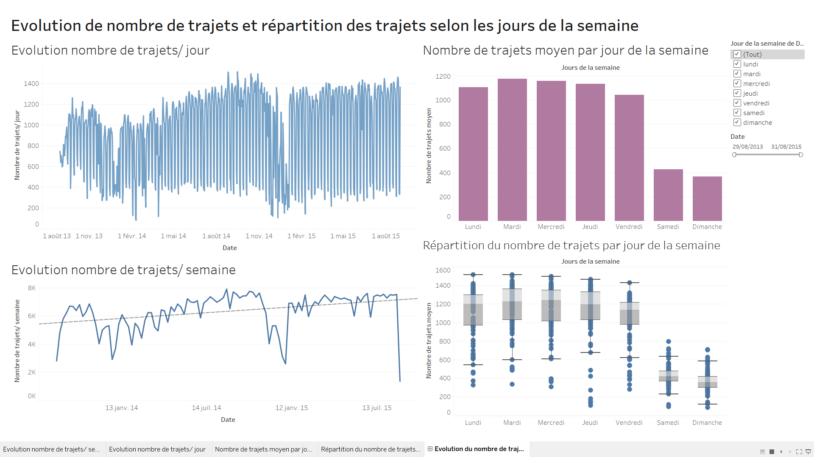
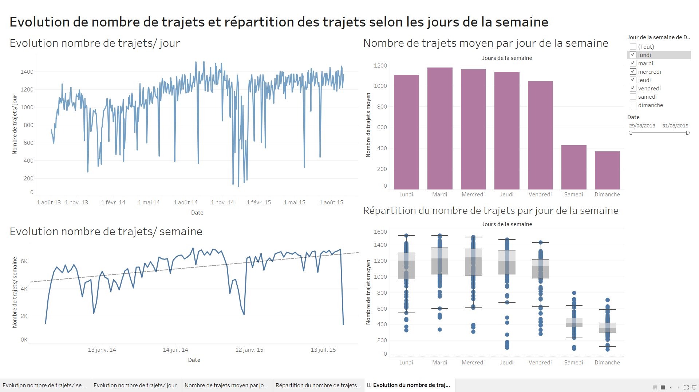
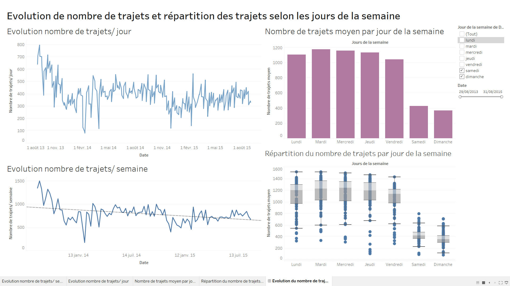
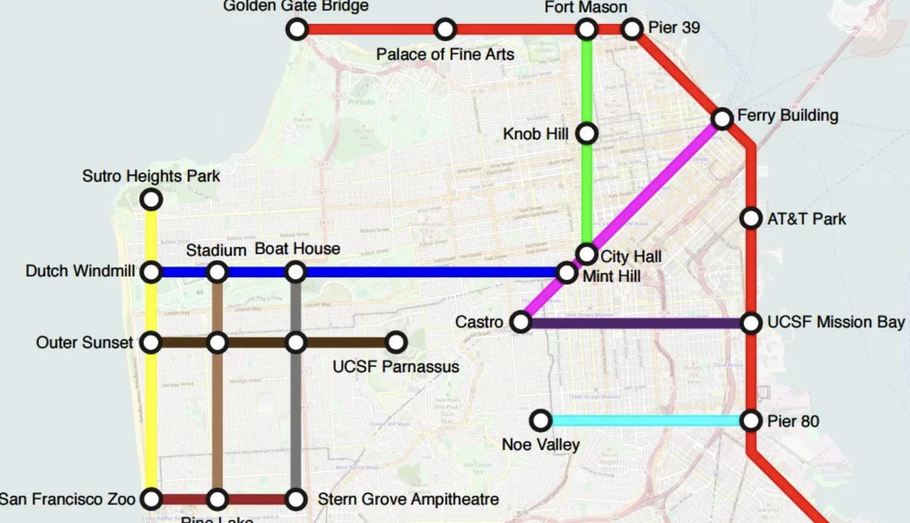

```{r setup, include=FALSE}
knitr::opts_chunk$set(echo = FALSE, warning = FALSE, message = FALSE)
```

# Analyse des Données du Service de Vélos en Libre-Service de la Baie de San Francisco

## Introduction

Ce projet vise à explorer et analyser les données du service de vélos en
libre-service de la Baie de San Francisco, avec l'objectif de comprendre
les facteurs influençant l'utilisation des vélos et d'identifier les
tendances d'utilisation. Les données, provenant de Kaggle, incluent des
informations détaillées sur les stations de vélo, la météo, le statut de
la station à un moment donné, et les trajets effectués.

Ces données correspondent plus précisément aux vélos de Bay Area Bike
Share qui était, jusqu'en 2015, le principal loueur de vélos en
libre-service 24/7 dans la baie de San Francisco. Cette entreprise
possédait 700 vélos et 70 stations dans la baie. Le jeu de données
disponible sur Kaggle nous donne les dernières données de ce service,
entre août 2013 et août 2015, qui étaient mises à disposition sur le
site de Bay Area Bike Share.

## Données

### Source

Les données proviennent de
[Kaggle](https://www.kaggle.com/datasets/benhamner/sf-bay-area-bike-share?select=trip.csv),
et sont constituées de quatre fichiers CSV distincts : `Station`,
`Weather`, `Status`, et `Trip`.

### Description

Nous avons choisi ces datasets pour les informations diversifiées qu’ils
proposent, décrites ci-dessous

-   **Station** : Ce dataset contient des données qui représentent une
    station où les utilisateurs peuvent récupérer ou restituer des
    vélos.
    -   *Contenu* : 70 éléments avec 7 caractéristiques.
-   **Weather** : Celui-ci donne des informations sur le nombre de vélos
    et de quais disponibles pour une station et une minute données.
    -   *Contenu* : 72M éléments avec 24 caractéristiques.
-   **Status** : Ici sont données des informations sur les déplacements
    individuels à vélo.
    -   *Contenu* : 670 000 éléments avec 4 caractéristiques.
-   **Trip** : Ce dernier dataset nous donne des informations sur la
    météo un jour spécifique pour certains codes postaux
    -   *Contenu* : 3665 éléments avec 11 caractéristiques \### Format

Chaque ensemble de données est formaté en CSV, ce qui facilite
l'importation et l'analyse dans divers outils d'analyse de données.

### Catégories et Sous-groupes

Les données sont divisées en quatre catégories principales correspondant
aux aspects clés du service de vélos en libre-service, permettant une
analyse multidimensionnelle de l'utilisation des vélos en fonction de la
météo, de la disponibilité des vélos, et des préférences de trajet des
utilisateurs.

### Caractéristiques des Données par Fichier

| Fichier     | Caractéristique                | Type de données (Quantitatif / Qualitatif) | Description                                                              |
|-----------------|-----------------------|-----------------|-----------------|
| **Station** | id                             | discrète                                   | Identifiant unique de la station                                         |
|             | name                           | nominale                                   | Nom de la station de vélo                                                |
|             | latitude                       | continue                                   | Coordonnée géographique en latitude de la station                        |
|             | longitude                      | continue                                   | Coordonnée géographique en longitude de la station                       |
|             | dock_count                     | discrète                                   | Nombre de places de vélos disponibles dans la station                    |
|             | city                           | nominale                                   | Nom de la ville dans laquelle la station est instalée                    |
|             | installation_date              | discrète                                   | Date d'installation de la station                                        |
| **Status**  | station_id                     | discrète                                   | Identifiant unique de la station                                         |
|             | bikes_available                | discrète                                   | Nombre de vélos disponibles dans la station                              |
|             | docks_available                | discrète                                   | Nombre de places vides disponibles dans la station                       |
|             | time                           | discrète                                   | Heure actuelle                                                           |
| **Trip**    | id                             | discrète                                   | Identifiant unique du trajet                                             |
|             | duration                       | discrète                                   | Durée du trajet                                                          |
|             | start_date                     | discrète                                   | Date et heure de début du trajet                                         |
|             | start_station_name             | nominale                                   | Nom de la station de départ                                              |
|             | start_station_id               | discrète                                   | Identifiant unique de la station de départ                               |
|             | end_date                       | discrète                                   | Date et heure de fin de trajet                                           |
|             | end_station_name               | nominale                                   | Nom de la station de fin                                                 |
|             | end_station_id                 | discrète                                   | Identifiant unique de la station d'arrivée                               |
|             | bike_id                        | discrète                                   | Identifiant unique du vélo                                               |
|             | subscription_type              | nominal                                    | Type d'abonnement de l'utilisateur                                       |
|             | zip_code                       | discrète                                   | Code postal                                                              |
| **Weather** | Date                           | discrète                                   | Date                                                                     |
|             | max_temperature_f              | continue                                   | Température maximale en degrés Fahrenheit                                |
|             | mean_temperature_f             | continue                                   | Température moyenne en degrés Fahrenheit                                 |
|             | min_temperature_f              | continue                                   | Température minimale en degrés Fahrenheit                                |
|             | max_dew_point_f                | continue                                   | Point de rosée maximal en degrés Fahrenheit                              |
|             | mean_dew_point_f               | continue                                   | Point de rosée moyen en degrés Fahrenheit                                |
|             | min_dew_point_f                | continue                                   | Point de rosée minimal en degrés Fahrenheit                              |
|             | max_humidity                   | continue                                   | Humidité maximale en %                                                   |
|             | mean_humidity                  | continue                                   | Humidité moyenne en %                                                    |
|             | min_humidity                   | continue                                   | Humidité minimale %                                                      |
|             | max_sea_level_pressure_inches  | continue                                   | Pression atmosphérique maximale au niveau de la mer en pouces de mercure |
|             | mean_sea_level_pressure_inches | continue                                   | Pression atmosphérique moyenne au niveau de la mer en pouces de mercure  |
|             | min_sea_level_pressure_inches  | continue                                   | Pression atmosphérique minimale au niveau de la mer en pouces de mercure |
|             | max_visibility_miles           | continue                                   | Visibilité maximale en miles                                             |
|             | mean_visibility_miles          | continue                                   | Visibilité moyenne en miles                                              |
|             | min_visibility_miles           | continue                                   | Visibilité minimale en miles                                             |
|             | max_wind_Speed_mph             | continue                                   | Vitesse maximale du vent en miles par heure                              |
|             | mean_wind_speed_mph            | continue                                   | Vitesse moyenne du vent en miles par heure                               |
|             | max_gust_speed_mph             | continue                                   | Vitesse maximale des rafales en miles par heure                          |
|             | precipitation_inches           | continue                                   | Volume des précipitations en pouces                                      |
|             | cloud_cover                    | continue                                   | Couverture nuageuse en oktas                                             |
|             | events                         | nominale                                   | Commentaires sur la météo du jour (Brouillard, pluie...)                 |
|             | wind_dir_degrees               | continue                                   | Direction du vent en degrés                                              |
|             | zip_code                       | dicrète                                    | Code postal                                                              |

## Plan d’Analyse

Nous aborderons plusieurs questions clés à travers notre analyse, qui se
divisent en deux parties pour répondre à notre problématique :

**Partie 1 - Quels sont les facteurs qui ont un impact sur l’utilisation
des vélos ?:**

1.  Quelle est la répartition des statuts des utilisateurs en fonction
    du trajet effectué (Subscriber/Customer) ?
    -   Pour les long trajets on peut s’attendre à ce qu’il y ait un
        pourcentage plus élevé de "subscribers" que de "customers".
    -   *Graphique* : Bar Chart
    -   *Dataset* : trip.csv
    -   *Features* : subscription_type, start_date, end_date
2.  Est-ce que les stations sont bien dimensionnées ? (suffisamment de
    docks)
    -   On va chercher à savoir si les capacités d’accueil des stations
        sont adaptées au flux entrant et sortant d’utilisateurs sur
        chaque station. On va comparer la capacité d’accueil d’une
        station par rapport au nombre de vélos qui y sont. Le problème
        que l’on peut rencontrer est au niveau du nombre d’éléments
        (environ 82 stations).
    -   *Graphique* : Multi Set Bar Chart ou Population chart
    -   *Dataset* : trip.csv, station.csv
    -   *Features*: dock_count, name, station_name
3.  Est-ce que le dénivelé a un impact sur les trajets effectués par les
    utilisateurs ?
    -   Nous nous attendons à ce qu’un trajet possédant plus de dénivelé
        soit moins emprunté par les utilisateurs.
    -   *Graphique*: Flow Map + Carte topographique à intégrer
    -   *Dataset*: trip.csv, station.csv
    -   *Features*: lat, long, name, station_name, start_station_name,
        end_station_name
4.  Quelle condition météorologique a le plus d’impact sur l’utilisation
    des vélos ?
    -   Nous souhaitons observer quelle condition météorologique impact
        le plus l’utilisation des vélos. Nous mettrons en comparaison
        les différentes informations météorologiques que nous possédons
        avec les données d’utilisations des vélos au cours d’une année.
    -   *Graphique*: Bar chart
    -   *Dataset*: weather.csv, trip.csv
    -   *Features*: start_date, date, mean_temperature_f, mean_humidity,
        mean_wind_speed_mph, precipitation_inches, cloud_cover,
        wind_dir_degrees

**Partie 2 - Quelles sont les tendances d’utilisation des vélos ?**

5.  Quelle est la durée moyenne des trajets en fonction de la météo ?
    -   On va chercher à observer la durée moyenne des trajets en
        fonction des conditions météorologiques.
    -   *Graphique*: Bar chart (pour chaque condition météorologique
        \~6)
    -   *Dataset*: weather.csv, trip.csv
    -   *Features*: start_date, end_date, duration, date,
        mean_temperature_f, mean_humidity, mean_wind_speed_mph,
        precipitation_inches, cloud_cover, wind_dir_degrees
6.  Comment la météo influence les trajets, en termes de distance et de
    destination ?
    -   Nous allons chercher quels sont les trajets effectués en
        fonction des conditions météorologiques.
    -   *Graphique*: Connexion Map pour chaque condition météorologique\
    -   *Dataset*: trip.csv, weather.csv, station.csv
    -   *Features*: start_date, end_date, date, start_station_name,
        end_station_name, name, lat, long, mean_temperature_f,
        mean_humidity, mean_wind_speed_mph, precipitation_inches,
        cloud_cover, wind_dir_degrees
7.  Quels sont les trajets les plus fréquentés ?
    -   Nous voulons observer quels sont les trajets les plus
        fréquentés, notamment leur type (trajet pour aller vers un lieu
        de travail, école, université, loisir). Nous n’aurons pas le
        trajet exact étant donné que le dataset nous donne seulement le
        point de départ et le point d'arrivée.
    -   *Graphique*: Arc diagram
    -   *Dataset*: trip.csv
    -   *Features*: start_station, end_station
8.  Quelles sont les stations les plus fréquentées (départs et arrivées)
    ?
    -   Nous cherchons à observer quelles stations ont le nombre
        d'utilisateurs le plus important.
    -   *Graphique*: Dot Map
    -   *Dataset*: trip.csv
    -   *Features*: start_station, end_station
9.  Quelles sont les durées des trajets en fonction des heures de la
    journée, de la saison ? Et comment l’utilisation des vélos varie au
    cours de la journée ?
    -   On cherche à représenter l’utilisation des vélos au cours de la
        journée, de l’année et voir si, au sein d’une même journée, il y
        a des plages horaires d’utilisation plus fortes ou faibles.
    -   *Graphique*: Bar chart (3 graphiques)
    -   *Dataset*: trip.csv
    -   *Features*: start_date, end_date, duration
10. Quel est le rapport entre départs et arrivées de chaque station ?
    -   On observe s’il y a des stations qui ont plus de départs que
        d’arrivées, et inversement.
    -   *Graphique*: Dot map
    -   *Dataset*: trip.csv
    -   *Features*: start_station_name, end_station_name
11. Existe-il une relation entre le nombre de vélos disponible à une
    station et la météo ?
    -   On voudrait voir si un temps moins propice à l’utilisation d’un
        vélo fait qu’il y a plus de vélos disponibles à une station.
    -   *Graphique*: Heatmap ou Scatterplot
    -   *Dataset*: status.csv, weather.csv
    -   *Features*: bikes_available, time, date, mean_temperature_f,
        mean_humidity, mean_wind_speed_mph, precipitation_inches,
        cloud_cover, wind_dir_degrees

## Analyse Exploratoire

```{r librairies, message=FALSE}
# Import des librairies
library(tidyverse)
library(ggplot2)
library(viridis)
library(data.table)
library(dplyr)
library(doParallel)
library(corrplot)
library(lubridate)
library(reshape2)
library(pheatmap)
library(igraph)
library(tidygraph)
library(ggraph)
library(leaflet)
```

```{r datasets}
# Import des datasets
trip <- read_csv("trip.csv", show_col_types = FALSE)
trips <- read_csv("trip.csv", show_col_types = FALSE)
weather <- read_csv("weather.csv", show_col_types = FALSE)
status <- read_csv("status.csv", show_col_types = FALSE)
station <- read_csv("station.csv", show_col_types = FALSE)
```

### Pré-analyse - Heatmap de corrélation des variables de nos dataset

```{r heatmaps 1, echo=FALSE, fig.width=10, fig.height=6, fig.align='center'}

# Convertir les variables catégorielles en indicatrices
station_data <- station %>%
  mutate_if(is.character, as.factor) %>%
  mutate_if(is.factor, as.numeric)

trip_data <- trip %>%
  mutate_if(is.character, as.factor) %>%
  mutate_if(is.factor, as.numeric)

status_data <- status %>%
  mutate_if(is.character, as.factor) %>%
  mutate_if(is.factor, as.numeric)

weather_data <- weather %>%
  mutate_if(is.character, as.factor) %>%
  mutate_if(is.factor, as.numeric)

# Sélectionner uniquement les colonnes numériques pour la corrélation
station_numeric <- station_data[sapply(station_data, is.numeric)]
trip_numeric <- trip_data[sapply(trip_data, is.numeric)]
status_numeric <- status_data[sapply(status_data, is.numeric)]
weather_numeric <- weather_data[sapply(weather_data, is.numeric)]

# Calculer les matrices de corrélation
station_corr <- cor(station_numeric, method = "pearson", use = "complete.obs")
trip_corr <- cor(trip_numeric, method = "pearson", use = "complete.obs")
status_corr <- cor(status_numeric, method = "pearson", use = "complete.obs")
weather_corr <- cor(weather_numeric, method = "pearson", use = "complete.obs")

# Créer la heatmap pour station.csv
corrplot(station_corr, type="upper", order="hclust", 
         tl.col = "black", tl.srt = 45, 
         title = "Heatmap de corrélation des variables numériques de station.csv")

# Créer la heatmap pour trip.csv
corrplot(trip_corr, type="upper", order="hclust", 
         tl.col = "black", tl.srt = 45, 
         title = "Heatmap de corrélation des variables numériques de trip.csv")

# Créer la heatmap pour status.csv
corrplot(status_corr, type="upper", order="hclust", 
         tl.col = "black", tl.srt = 45, 
         title = "Heatmap de corrélation des variables numériques de status.csv")

# Créer la heatmap pour weather.csv
corrplot(weather_corr, type="upper", order="hclust", 
         tl.col = "black", tl.srt = 45, 
         title = "Heatmap de corrélation des variables numériques de weather.csv")

```

####Analyse

*station.csv* On observe une forte corrélation négative entre la
latitude et la longitude et également une corrélation négative entre la
longitude et id. Il n'y a rien de vraiment notable sur cett heatmap, on
peut s'attendre à ce qu'il y a une corrélation entre latitude et
longitude. Par contre, on pourrait essayer de comprendre pourquoi une
corrélation existe entre l'id de la station et la longitude.

*trip.csv* Il n'existe visiblement pas de corrélations notables entre
les variables de ce dataset. On observe une petite corrélation positive
entre le code zip et le type d'abonnement (zip_code / subscription_type)
et la station de début et la station de fin (start_station_id et
end_station_id). Une forte corrélation positive existe entre la date de
début d'un trajet et sa date de fin (start_date/end_date).

*status.csv* On observe une corrélation négative entre le nombre de
vélos disponible et le nombre de dock disponible
(bikes_available/docks_available), ce résultat était attendu car plus il
y a de vélos disponible à la station, moins les docks sont disponibles.

*weather.csv* De façon plutôt logique, on observe sur la heatmap des
corrélations entre les means, max et min de chaque conditions
météorologiques.

Etant donné que ces heatmaps ne nous donne pas plus d'informations que
cela pour chaque dataset, il s'agit de croiser les datasets ensemble
pour observer s'il existe des corrélations entre certaines variables,
auxquels nous n'aurions pas pensé lors de la rédaction de notre plan
d'analyse. Pour la lisibilité des heatmaps, les dataset vont être
fusionnés deux à deux. Nous avons donc essayer de faire les choix de
fusion les plus pertinents :

```{r heatmaps 2, echo=FALSE, fig.width=10, fig.height=6, fig.align='center'}

# Convertir les variables catégorielles en indicatrices
station_data <- station %>%
  mutate_if(is.character, as.factor) %>%
  mutate_if(is.factor, as.numeric)

trip_data <- trip %>%
  mutate_if(is.character, as.factor) %>%
  mutate_if(is.factor, as.numeric)

status_data <- status %>%
  mutate_if(is.character, as.factor) %>%
  mutate_if(is.factor, as.numeric)

weather_data <- weather %>%
  mutate_if(is.character, as.factor) %>%
  mutate_if(is.factor, as.numeric)

# Fusionner weather et trip
weather_trip <- weather_data %>%
  left_join(trip_data, by = c("date" = "start_date"))

# Sélectionner les colonnes numériques
numeric_weather_trip <- weather_trip %>%
  select_if(is.numeric)

# Calculer la matrice de corrélation
corr_weather_trip <- cor(numeric_weather_trip, use = "complete.obs")

# Créer la heatmap
corrplot(corr_weather_trip, type = "upper", order = "hclust",
         tl.col = "black", tl.srt = 45, 
         title = "Correlation Heatmap: Weather and Trip")

# Fusionner weather et station
weather_station <- weather_data %>%
  left_join(station_data, by = c("date" = "installation_date"))

# Sélectionner les colonnes numériques
numeric_weather_station <- weather_station %>%
  select_if(is.numeric)

# Calculer la matrice de corrélation
corr_weather_station <- cor(numeric_weather_station, use = "complete.obs")

# Créer la heatmap
corrplot(corr_weather_station, type = "upper", order = "hclust",
         tl.col = "black", tl.srt = 45, 
         title = "Correlation Heatmap: Weather and Station")

# Fusionner weather et status
weather_status <- weather_data %>%
  left_join(status_data, by = c("date" = "time"))

# Sélectionner les colonnes numériques
numeric_weather_status <- weather_status %>%
  select_if(is.numeric)

# Calculer la matrice de corrélation
corr_weather_status <- cor(numeric_weather_status, use = "complete.obs")

# Créer la heatmap
corrplot(corr_weather_status, type = "upper", order = "hclust",
         tl.col = "black", tl.srt = 45, 
         title = "Correlation Heatmap: Weather and Status")

# Fusionner trip et station
trip_station <- trip_data %>%
  left_join(station_data, by = c("start_station_id" = "id"))

# Sélectionner les colonnes numériques
numeric_trip_station <- trip_station %>%
  select_if(is.numeric)

# Calculer la matrice de corrélation
corr_trip_station <- cor(numeric_trip_station, use = "complete.obs")

# Créer la heatmap
corrplot(corr_trip_station, type = "upper", order = "hclust",
         tl.col = "black", tl.srt = 45, 
         title = "Correlation Heatmap: Trip and Station")

# Fusionner station et status
station_status <- station_data %>%
  left_join(status_data, by = c("id" = "station_id"))

# Sélectionner les colonnes numériques
numeric_station_status <- station_status %>%
  select_if(is.numeric)

# Calculer la matrice de corrélation
corr_station_status <- cor(numeric_station_status, use = "complete.obs")

# Créer la heatmap
corrplot(corr_station_status, type = "upper", order = "hclust",
         tl.col = "black", tl.srt = 45, 
         title = "Correlation Heatmap: Station and Status")


```

####Analyse

*Entre weather et trip / entre weather et status* On retrouve des
corrélations entre les variables en lien avec la météo. Ce qui est
notable est que ces corrélations sont moins fortes que pour la heatmap
entre weather et station.

*Entre weather et station* Ici on observe qu'il y a des corrélations
forte pour la latitude et longitdue avec certaines condition
météorologique, on pourrait évventuellement faire une carte des
conditions météorologiques pour comprendre comment cette corrélation
prend forme. On pourrait observer cela sur chacune des années du dataset
pour voir s'il y a une évolution du temps à SF et si cela à un impact
sur l'utilisation des vélos aux stations.

*Entre trip et station* On trouve ici plusieurs corrélations
intéressantes : - entre les stations de début et de fin et la latitute
et longitude (start_station_id/latitude ET longitude,
end_station/latitude ET longitude), nous pouvons peut-être voir, grâce à
la question 3 de notre plan d'analyse, la relation entre la position de
la station de départ et sa position et pareillement pour la station
d'arrivée.

*Entre status et station* On ne trouve pas ici de liens particulier
intéressante pour notre analyse, la corrélation entre dock_count et
bikes_available / docks_available semble naturel.

```{r import_clear_data, include = FALSE}
# On importe le dataset
trip_data <- trip

# Trip filter
# On supprime les champs non intéressants, on change le format de la date afin de pouvoir l'exploiter
trip_filter <- subset(trip_data, select = c(id, duration, start_date))
trip_filter$start_date <- as.POSIXct(trip_filter$start_date, format = "%m/%d/%Y %H:%M", tz = "UTC")
trip_filter$start_date <- as.Date(trip_filter$start_date)
# Filtrer les trajets de moins de 120 minutes
trip_filter <- trip_filter %>%
  rename(date = start_date) %>%
  mutate(duration = duration / 60) %>%
  filter(duration <= 120)
```

### Partie 0 - Analyse Macro du dataset

#### 0.1 Comment évolue l'utilisation du service de vélos libre-service entre août 2013 et août 2015?

Avant d'étudier les tendances d'utilisation des vélos et l'influence des
conditions météorologiques, il est intéressant d'étudier l'évolution de
l'utilisation des vélos sur la période couverte par les données.

On suppose que l'utilisation des vélos a augmentée progressivement à
partir de la mise en service du réseau en août 2013. On pourrait
observer des variations en fonction des différents mois de l'année à
cause des variations météorologiques. Une diminution générale de
l'utilisation des vélos au milieu de l'année 2015 pourrait être la cause
de la suspension du service à partir de cette période.

##### Visualisations

Pour étudier l'évolution de l'utilisation du réseau de vélos libre
service nous allons utiliser successivement plusieurs line chart afin de
visualiser dans un prémier temps l'évolution du nombre de trajets
quotidiens, puis l'évolution de la durée moyenne des trajets par jour,
sur la période couverte par les données disponibles.

*Evolution du nombre de trajets entre août 2013 et août 2015*

```{r evolution_trajets_j_s, echo = FALSE}
#superposition des courbes 
# Calculer le nombre de trajets par jour
daily_trips <- trip_filter %>%
  group_by(date) %>%
  summarise(num_trips = n())

# Calculer le nombre de trajets par semaine
trip_filter <- trip_filter %>%
  mutate(week = floor_date(date, "week"))
weekly_trips <- trip_filter %>%
  group_by(week) %>%
  summarise(num_trips = n()/7)

# Fusionner les deux jeux de données
daily_trips <- daily_trips %>%
  mutate(type = "Jour")
weekly_trips <- weekly_trips %>%
  rename(date = week) %>%
  mutate(type = "Semaine")

combined_data <- bind_rows(daily_trips, weekly_trips)

ggplot(combined_data, aes(x = date, y = num_trips, color = type, group = type)) +
  geom_line(data = subset(combined_data, type == "Jour"), linewidth = 0.5) + 
  geom_line(data = subset(combined_data, type == "Semaine"), linewidth = 1.5) + 
  scale_color_manual(values = c("Jour" = "orange", "Semaine" = "purple")) +
  labs(title = "Évolution du nombre de trajets par jour et par moyenne hebdomadaire",
       x = "Date",
       y = "Nombre de trajets",
       color = "Type de données") +
  theme_minimal()
```

En visualisant l'évolution du nombre de trajets quotidiens on est
confrontés à des variations importantes, qui semblent régulières, et qui
nous empêchent d'émettre une hypothèse sur une tendance d'utilisation
sur les deux ans. En visualisant l'évolution du nombre de trajets
hebdomadaire, réduisant les variations régulières, on met en avant les
tendance d'utilisation des vélos sur l'année.

Comme évoqué dans les hypothèses, on note une augmentation du nombre de
trajets à partir de la mise en service du réseau en août 2013, ainsi
qu'une diminution autour de août 2015. Cette diminution soudaine ne
semble pas dûe à un désintérêt des utilisateurs (utilisation constante
jusque là), mais plutôt à la désinstallation progressive des stations en
vue de l'arrêt du service en août 2015. Au cours de la période
d'utilisation du réseau, on remarque des tendances rélatives aux
différetes périodes de l'année. Les minimums locaux enregistrés
annuellement se positionnent au mois de décembre (début puis fin
décembre). A partir du mois de janvier on remarque une augmentation
générale du nombre de trajets hebdomadaires.

*Evolution de la durée moyenne des trajets entre août 2013 et août 2015*

```{r evolution_dur_trajets_j_s, echo = FALSE}
#superposition des courbes 
# Ajouter une colonne pour la semaine
trip_filter <- trip_filter %>%
  mutate(week = floor_date(date, "week"))

# Calculer la durée moyenne des trajets par jour
daily_avg_duration <- trip_filter %>%
  group_by(date) %>%
  summarise(avg_duration = mean(duration))

# Calculer la durée moyenne des trajets par semaine
weekly_avg_duration <- trip_filter %>%
  group_by(week) %>%
  summarise(avg_duration = mean(duration))

daily_avg_duration <- daily_avg_duration %>%
  mutate(type = "Jour")
weekly_avg_duration <- weekly_avg_duration %>%
  rename(date = week) %>%
  mutate(type = "Semaine")

combined_data <- bind_rows(daily_avg_duration, weekly_avg_duration)

ggplot(combined_data, aes(x = date, y = avg_duration, color = type, group = type)) +
  geom_line(data = subset(combined_data, type == "Jour"), linewidth = 0.5) + 
  geom_line(data = subset(combined_data, type == "Semaine"), linewidth = 1.5) + 
  scale_color_manual(values = c("Jour" = "orange", "Semaine" = "purple")) +
  labs(title = "Évolution de la durée moyenne des trajets par jour et par semaine",
       x = "Date",
       y = "Durée moyenne des trajets (min)",
       color = "Type de données") +
  theme_minimal()
```

En visualisant l'évlution de la durée moyenne quotidienne des trajets,
on est encore une fois confrontés à des variations très importantes, qui
semblent régulières et qui nous empêchent d'émettre une hypothèse sur
une tendance d'utilisation sur les deux ans. En visualisant l'évolution
de la durée moyenne hebdomadaire des trajets, réduisant les variations
régulières, on espère mettre en avant les tendance d'utilisation des
vélos sur l'année.

En étudiant l'évolution sur deux ans de la durée moyenne hebdomadaire
des trajets enregistrés, on ne remarque pas de tendance évidente au
premier abord. On note deux pics en août 2013 lors de la mise en service
du réseau et en août 2015 lors de sa suspension. On pourrait expliquer
ces particularités par des tests effectués (août 2013) ou des trajets
enregistrés lors de la suspension du service par les équipes techniques
dont la durée étonnante fausse les données des trajets enregistrés
(août2015). Au cours de l'année, on remarque des maximums locaux à la
fin des mois de décembre

##### Interprétation des graphiques

On ne remarque pas d'évolution pmarticulière dans l'utilisation du
réseau de vélos libre-service de San Francisco. On remarque des
irrégularités liées à l'installation (août 2013) et à la désinstallation
(août 2015) du réseau. On note des tendances d'utilisation selon les
différentes périodes de l'année :

-   le nombre de trajets enregistrés augmente progressivement de janvier
    à novembre,
-   les minimums de nombre de trajets sont enregistrés au mois de
    décembre,
-   la durée moyenne des trajets est constante et augmente légèrement au
    mois de décembre.

On émet l'hypothèse selon laquelle le nombre et la durée moyenne des
trajets dépendent en partie des conditions météorologiques enregistrées
: des conditions favorables encouragent l'utilisation des vélos, pour
des trajets plus longs. Parallèlement, des conditions ddéfavorables
peuvent soit décourager l'utilisation des vélos pour des trajets longs
(favoriser des trajets courts) ou rallonger des trajets rapides. Nous
aurons l'occasion de vérifier cette hypothèse au cours de notre étude.

##### Remarques

En souhaitant visualiser l'évolution journalière de l'utilisation du
service (nombre/ durée moyenne) nous avons été confrontés à des courbes
présentant des variations importantes, qui semblent régulières et qui
nous empêchent de conclure sur des tendances d'utilisation.Nous emettons
l'hypothèse selon laquelle il existe des variations d'utilisation des
vélos importantes selon les jours de la semaine, en terme de quantité de
trajets et de durée.

#### 0.2 Comment varie l'utilisation du réseau de vélos libre-service en fonction des jours de la semaine?

Nous avons pu observer des variations importantes et en apparence
régulières relatives à l'utilisation des vélos lors de notre étude de
l'évolution du nombre de trajets et de la durée moyenne quotidienne.
Nous imaginons que ces disparités sont dûes à un usage différents selon
les différents jours de la semaine.

Selon les tendances d'utilisation des vélos, on peut émettre différentes
hypothèses. Si les utilisateurs favorisent les vélos pour des trajets
quotidiens (domicile - lieu de travail par exemple), on peut s'attendre
à observer davantage de trajets en semaine, pour des trajets plus
courts. Si au contraire ils sont utilisés pour le loisir (balade/
déplacements pour le loisir), on peut s'attendre à noter davantage de
trajets effectués en fin de semaine, pour des durées plus longues.

##### Visualisations

Pour étudier les tendances d'utilisation des vélos en fonction des jours
de la semaine, nous utilisons un barchart pour réprésenter
succéssivement le nombre de trajets et la durée moyenne des trajets. Si
on observe une corrélation entre les données, il serait intéressant de
les réunir sur un même graphique.

*Nombre de trajets et durée moyenne des trajets en fonction des jours de
la semaine*

```{r nb_trajets_dur_moy_jour_de_la_semaine, echo = FALSE}
# Ajouter une colonne pour le jour de la semaine
trip_filter <- trip_filter %>%
  mutate(day_of_week = weekdays(date))
trip_filter$day_of_week <- factor(trip_filter$day_of_week,
                                  levels = c("lundi", "mardi", "mercredi", "jeudi", "vendredi", "samedi", "dimanche"))

# Calculer le nombre moyen de trajets par jour de la semaine
average_trips_per_day <- trip_filter %>%
  group_by(day_of_week) %>%
  summarise(avg_num_trips = n() / n_distinct(date))

# Calculer la durée moyenne des trajets par jour de la semaine
average_duration_per_day <- trip_filter %>%
  group_by(day_of_week) %>%
  summarise(avg_duration = mean(duration))

combined_data <- merge(average_duration_per_day, average_trips_per_day, by = "day_of_week")
combined_data_long <- combined_data %>%
  pivot_longer(cols = c(avg_duration, avg_num_trips), names_to = "metric", values_to = "value")

# Ajuster la valeur de la durée pour l'échelle secondaire
combined_data_long <- combined_data_long %>%
  mutate(adjusted_value = ifelse(metric == "avg_duration", 
                                 value * (max(combined_data$avg_num_trips) / max(combined_data$avg_duration)), 
                                 value))

ggplot(combined_data_long, aes(x = day_of_week, y = adjusted_value, fill = metric)) +
  geom_col(position = position_dodge()) +
  scale_y_continuous(
    name = "Nombre moyen de trajets",
    sec.axis = sec_axis(~ . / (max(combined_data$avg_num_trips) / max(combined_data$avg_duration)), 
                        name = "Durée moyenne des trajets (min)")
  ) +
  scale_fill_manual(name = "Métrique", values = c("avg_num_trips" = "purple", "avg_duration" = "orange"), 
                    labels = c("avg_num_trips" = "Nombre moyen de trajets", "avg_duration" = "Durée moyenne des trajets")) +
  labs(title = "Nombre moyen de trajets et durée moyenne des trajets par jour de la semaine",
       x = "Jour de la semaine") +
  theme_minimal() +
  theme(legend.position = "bottom")
```

On observe facilement une corrélation entre le nombre moyen et la durée
moyenne des trajets enregistrés chaque jour. En effet, plus de trajets
sont effectués en semaine pour une durée d'une dizaine de minutes, ces
derniers peuvent correspondre aux déplacements quotidiens des habitants
de San Francisco, pour se rendre au travail/ en courses. Les trajets
enregistrés les samedis et dimanches sont nettement moins nombreux et
leur durée moyenne est supérieure à celle des trajets en semaine; on
suppose qu'ils correspondent à des trajets de loisir, pour des
déplacements occasionnels, des promenades. On notera que la variation
entre la durée moyenne des trajets en semaine et le week-end n'est que
de quelques minutes (5-7 minutes); une interprétation reste intéressante
compte tenu de la constance des résultats obtenus de lundi à vendredi. A
l'issue de cette visualisation nous avons souhaité étudier la
répartition des données à travers des boxplot afin d'approfondir notre
étude.

*Répartition du nombre de trajets et de la durée moyenne des trajets en
fonction des jours de la semaine*

```{r rep_nb_trajets_jour_de_la_semaine, echo = FALSE}
# Répartition du nombre de trajets par jour de la semaine (diagramme moustache)
daily_trip_count <- trip_filter %>%
  group_by(day_of_week, date) %>%
  summarise(num_trips = n(), .groups = 'drop')

# Tracer le diagramme en boîte avec ggplot2
ggplot(daily_trip_count, aes(x = day_of_week, y = num_trips)) +
  geom_boxplot(fill = "purple") +
  labs(title = "Répartition du nombre de trajets par jour de la semaine",
       x = "Jour de la semaine",
       y = "Nombre de trajets") +
  theme_minimal()
```

On remarque que les valeurs du nombre de trajets enregistrés chaque jour
sont peu étendues, quelques outlier existent. La moitié des valeurs
enregistrées se situe dans un intervalle réduit, l'étendue du nombre de
trajets enregistrés le week-end est faible, les valeurs sont nettement
moins importantes que les nombres de trajets enregistrés en semaine.

```{r rep_dur_trajets_jour_de_la_semaine, echo = FALSE}
#on limite l'axe des ordonnées à 30 min pour mieux visualiser la répartition des durées, environ 20 000 trajets non visibles (3%)
ggplot(trip_filter, aes(x = day_of_week, y = duration)) +
  geom_boxplot(fill = "purple") +
  labs(title = "Répartition des durées moyennes des trajets par jour de la semaine",
       x = "Jour de la semaine",
       y = "Durée des trajets (minutes)") +
  ylim(0, 30) +
  theme_minimal()
```

Les répartitions des durées moyennes enregistrées en semaine sont
identiques entre elles. La répartition des durées moyennes enregistrées
samedi et dimanche sont casiment identiques. Le graphique comporte un
nombre important d'outliers, pour mieux visualiser la répartition des
données interessantes nous avons limité l'axe des ordonnées à 30 minutes
excluant environ 3% des valeurs.

##### Interprétation des graphiques

Nous avons étudié les tendances d'utilisation des vélos en comparant le
nombre de trajets moyen et la durée moyenne enregistrés par jour, puis
la répartition de ces deux variables. Nous observons nettement que les
vélos sont davantage utilisés en semaine, pour des trajets plus courts,
on suppose qu'il s'agit de trajets quotidiens. Moins de trajets sont
effectués les samedis et dimanches, mais les durées moyennes sont plus
élevées, pouvant correspondre à des trajes occasionnel, de loisir.

Etudier la répartition de ces deux variables (nombre de trajets/jour et
durée moyenne/jour) nous permet de confirmer ces différence
d'utilisation. De manière générale on note une répartition presque
identique des données pour les jours de lundi à vendredi, ainsi qu'entre
samedi et dimanche. On note aussi des données peu étendues et une
quantité limitée d'outlier compte tenu de la quantité de données
traitées. La répartition des moyennes de durées des trajets quotidienne
présente davantage d'outliers.

##### Remarques

En étudians l'évolution de l'utilisation du service sur deux ans nous
avons soulevé des tendances d'utilisation en fonction des différents
jours de la semaine. De plus, nous avons noté une variation du nombre de
trajets enregistrés au cours de l'année. Il serait intéressant de
poursuivre une étude similaire à celle-ci en fonction des différents
mois de l'année, en fonction des saisons. Pour approfondir cette étude,
nous nous pencherons également sur les tendances d'utilisation des vélos
libre-service de San Francisco en fonctions des conditions
météorologiques enregistrées (température, vent, précipitation...).

#### Tableau

Nous avons utilisé l'outil Tableau pour représenter les graphiques de
cette question. L'outil nous a permis d'extraire les données facilement,
d'obtenir des visualisations rapidement et de manipuler les diagrammes
afin d'en tirer des informations complémentaires à notre étude. En
effet, voicile tableau de bord obtenu regroupant l'évolution du nombre
de trajets quotidien sur la période étudiée, l'évolution du nombre de
trajets hebdomadaires, le nombre de trajets moyen par jour de la semaine
(bar chart) et la répartition du nombre de trajets par jour de la
semaine. Nous avons ajouté des filtres visibles sur la droite du tableau
de bord permettant de selectionner les jour de la semaine concernés
et/ou de définir une plage de date. Ces filtres n'agissent que sur les
line chart.



Sur cette deuxième capture d'écran nous nous sommes servis du filtre
pour ne visualiser que l'évolution du nombre de trajets effectués du
lundi au vendredi. On remarque l'apparition d'une tendance sur la courbe
modélisant l'évolution du nombre de trajets quotidiens malgré la
persistance d'outliers.



Sur cette troisième capture d'écran on a, à l'inverse, uniquement
conservé les données relatives au nombre de trajets enregistrés les
samedi et les dimanches. De même que précédemment, on observe une
diminition des variations sur le premier graphique. En comparant avec la
capture d'écran illustrant les données enregistrées en semaine, on voit
nettement la différence d'évolution du nombre de trajets enregistrés du
lundi au vendredi par rapport au week end.s



### Partie 1 - Quels sont les facteurs qui ont un impact sur l’utilisation des vélos ?

#### 1. Quelle est la répartition des statuts des utilisateurs en fonction du trajet effectué (Subscriber/Customer) ?

```{r question 1}

  # 1. Définir les étiquettes des intervalles sans notation scientifique
 interval_labels <- c("0 - 4", "4 - 8", "8 - 12", "12 - 16", "16 - 20", "20 - 24", "24 - 28", "28 - 32", "32 - 36", "36 - 40", "40 - 44", "44 - 48", "48 - 52", "52 - 56", "56 - 60")
 # 2. Créer les intervalles avec les étiquettes spécifiées(jusqu'à 68 minutes)
 trip$interval <- cut(trip$duration, breaks = seq(0, 3600, by = 240), include.lowest = TRUE, labels = interval_labels)

 
 # 3. Calculer la répartition entre les abonnés et les clients pour chaque intervalle
 interval_counts <- table(trip$interval, trip$subscription_type)
 interval_percentages <- prop.table(interval_counts, margin = 1) * 100
 
 # 4. Convertir la table en dataframe, en spécifiant les noms de colonnes
 interval_percentages_df <- as.data.frame(interval_percentages)
 colnames(interval_percentages_df) <- c("Interval", "Type", "Percentage")

 # 5. Créer un diagramme à barres avec une barre par intervalle, montrant la répartition en pourcentage entre les abonnés et les clients
 interval_percentages_df$Percentage <- round(interval_percentages_df$Percentage)
 ggplot(interval_percentages_df, aes(x = Interval, y = Percentage, fill = Type, label = paste0(Percentage, "%"))) +
   geom_bar(stat = "identity", position = "stack") +
   geom_text(position = position_stack(vjust = 0.5), color = "white", size = 3) +
   labs(title = "Rapport entre Customer et Subscriber par intervalle",
        x = "Intervalles de durée de trajets (minutes)",
        y = "Rapport Subscriber/Customer en pourcentage", 
        fill = "Type") +
   theme_minimal() +
   theme(axis.text.x = element_text(angle = 45, hjust = 1)) 
 
```

##### Analyse

###### Observations

Ce graphique analyse l'évolution du rapport entre abonnés (subscribers)
et clients (customers). Les abonnés payent un abonnement mensuel pour
avoir accès au vélos en illimités, alors que les customers payent leurs
trajets à l'unité. Sur les trajets courts, la proportion d’abonnés est
très forte (environ 90%), mais elle dégringole au fur et à mesure que
les trajets rallongent. On a un équilibre entre abonnés et clients sur
les trajets entre 20 et 24 minutes. Sur les trajets longs, la tendance
est inversée avec un net avantage aux clients (environ 90 % de clients
sur les trajets supérieurs à 40 minutes). C’est donc l’inverse de ce que
nous avions prédit (plus de subscriber pour les longs trajets). On peut
l’expliquer par le fait que les abonnées n’hésitent pas à prendre le
vélo même sur des courts trajets, vu qu’il ne payent pas au trajet,
alors que les clients vont préférer marcher ou un autre moyen de
transport pour ne pas payer. De plus, les abonnées utilisent souvent le
vélo sinon ils ne s’abonneraient pas car cela ne serait pas rentable, et
les trajets les plus courants dans la vie quotidienne sont plutôt
courts. A contrario, sur les longs trajets qui sont sûrement plutôt des
ballades que des déplacements, les clients, donc usagers ponctuels, sont
plus nombreux. Ils utilisent rarement les vélos, mais pour des occasions
spécifiques.

#### 2. Est-ce que les stations sont bien dimensionnées ? (suffisamment de docks)

```{r status, fig.width=10, fig.height=6, fig.align='center'}

# Calcul du taux d'occupation pour chaque enregistrement
status_data <- status %>%
  mutate(occupation_rate = (bikes_available / docks_available)*100)

# Analyser le taux d'occupation moyen par station
station_occupancy <- status_data %>%
  group_by(station_id) %>%
  summarise(
    average_occupation = mean(occupation_rate, na.rm = TRUE),
    .groups = 'drop'
  )

# Classification des stations basée sur leur taux d'occupation moyen
station_occupancy <- station_occupancy %>%
  mutate(status = case_when(
    average_occupation < 50 ~ "Surdimensionnée",
    average_occupation > 90 ~ "Sous-dimensionnée",
    TRUE ~ "Adequatement dimensionnée"
  ))

# Visualisation des données
ggplot(station_occupancy, aes(x = factor(station_id), y = average_occupation, fill = status)) +
  geom_bar(stat = "identity", color = "black") +
  scale_fill_manual(values = c("Surdimensionnée" = "red", "Sous-dimensionnée" = "blue", "Adequatement dimensionnée" = "green")) +
  labs(title = "Taux d'occupation des stations entre 2013 et 2015", x = "Station ID", y = "Taux d'occupation moyen %") +
    theme_minimal() +
  theme(
    axis.text.x = element_text(angle = 90, vjust = 0.5),
    plot.title = element_text(face = "bold", size = 14),
    legend.title = element_text(size = 12),
    legend.text = element_text(size = 10)
  ) + ylim(0, 150)

```

##### Analyse

###### Observations

Dans le jeu de donnée status.csv, nous avons les données des stations
pour 3 années. Pour chaque station, il y a des enregistrements effectués
toutes les minutes pour connaître l'état de la station (nombre de vélos
stationnés et le nombre de docks disponibles).

On observe que les stations sont, au global, mal dimensionnées. Seules
les stations 5 et 83 ont toujours été en moyenne bien dimensionnées. On
peut se demander si, au cours des années les dimensions ont toujours été
les mêmes et si le taux d'occupation aurait évoluer au cours du temps.
La question qui découle de cette observation est :

#### 2 Bis. Pour chaque année, est-ce que le dimensionnement des stations changent et sont-elles mieux dimensionnées d'une année à l'autre ? :

```{r question 2, fig.width=9, fig.height=5, fig.align='center'}

# 1. Fonction pour générer le graphique pour une année spécifique
generate_plot <- function(data, year) {
  data_filtered <- data %>%
    filter(year == !!year)
  
  ggplot(data_filtered, aes(x = factor(station_id), y = average_occupation, fill = status)) +
    geom_bar(stat = "identity", color = "black") +
    scale_fill_manual(values = c("Surdimensionnée" = "red", "Sous-dimensionnée" = "blue", "Adéquatement dimensionnée" = "green")) +
    labs(title = paste("Taux d'occupation des stations en", year), x = "Station ID", y = "Taux d'occupation moyen %") +
    theme_minimal() +
    theme(
      axis.text.x = element_text(angle = 90, vjust = 0.5),
      plot.title = element_text(face = "bold", size = 14),
      legend.title = element_text(size = 12),
      legend.text = element_text(size = 10)
    ) + ylim(0, 150)
}

# 2. Préparation des données
status_data <- status %>%
  mutate(time = ymd_hms(time),
         year = year(time)) %>%
  filter(year %in% c(2013, 2014, 2015)) %>%
  mutate(occupation_rate = (bikes_available / docks_available) * 100)

station_occupancy <- status_data %>%
  group_by(station_id, year) %>%
  summarise(
    average_occupation = mean(occupation_rate, na.rm = TRUE),
    .groups = 'drop'
  ) %>%
  mutate(status = case_when(
    average_occupation < 50 ~ "Surdimensionnée",
    average_occupation > 90 ~ "Sous-dimensionnée",
    TRUE ~ "Adéquatement dimensionnée"
  ))

# 3. Création des graphiques pour chaque année
plot_2013 <- generate_plot(station_occupancy, 2013)
plot_2014 <- generate_plot(station_occupancy, 2014)
plot_2015 <- generate_plot(station_occupancy, 2015)

# 4. Setup du layout
par(mfrow = c(1, 3)) 

# 5. Visualisations
plot(plot_2013)
plot(plot_2014)
plot(plot_2015)


```

##### Analyse

###### Observations

Sur ces trois graphiques, on observe majoritairement des stations qui
sont sous-dimensionnées. On peut voir une évolution entre chaque année :

-   En 2014, il n'y a plus de stations sur-dimensionnées par rapport à
    2013.
-   En 2015, on observe plus de stations adéquatement dimensionnée qu'en
    2013 et 2014.

On peut supposer que Bay Area Bike Share a essayé d'ajuster ses services
au fil des années. On peut conclure que les stations ne sont
majoritairement pas dimensionnées correctement.

NB : le taux d'occupation moyen a été limité à 150% afin de pouvoir
mieux comparer visuellement les données présentées pour chaque année. En
2013, le taux d'occupation varie entre 0% et 200% En 2014, le taux
d'occupation varie entre 0% et 150% En 2015, le taux d'occupation varie
entre 0% et 200% On peut noter qu'au global, entre 2013 et 2015, le taux
d'occupation varie entre 0% et 150%.

###### Améliorations

La méthode de calcul pour le taux d'occupation moyen est à améliorer. Le
calcul est effectué sur toutes les entrées d'une année, mais vu le
volume de données, peut-être que l'on pourrait échantillonner pour avoir
une meilleure idée du dimensionnement. A voir si une autre méthode de
calcul serait plus adaptée aussi.

#### 3. Est-ce que le dénivelé a un impact sur les trajets effectués par les utilisateurs ? (fait sur Shiny Dashboard)

##### Durée moyenne des trajets par départ (bleu) et arrivée (rouge)

```{r stations circles}

# Lire les données des fichiers CSV
trips <- read_csv("trip.csv")
stations <- read_csv("station.csv")

# Convertir les durées de trajets de secondes en minutes
trips <- trips %>%
  mutate(duration = duration / 60)

# Calculer le temps moyen de trajet au départ de chaque station
avg_duration_start <- trips %>%
  group_by(start_station_id) %>%
  summarize(avg_duration = mean(duration)) %>%
  rename(station_id = start_station_id)

# Calculer le temps moyen de trajet à l'arrivée à chaque station
avg_duration_end <- trips %>%
  group_by(end_station_id) %>%
  summarize(avg_duration = mean(duration)) %>%
  rename(station_id = end_station_id)

# Fusionner les temps moyens avec les données des stations
stations <- stations %>%
  rename(station_id = id) %>%
  left_join(avg_duration_start, by = "station_id") %>%
  rename(avg_duration_start = avg_duration) %>%
  left_join(avg_duration_end, by = "station_id") %>%
  rename(avg_duration_end = avg_duration)

# Remplacer les NA par 0 pour éviter les erreurs dans le tracé des cercles
stations <- stations %>%
  mutate(
    avg_duration_start = ifelse(is.na(avg_duration_start), 0, avg_duration_start),
    avg_duration_end = ifelse(is.na(avg_duration_end), 0, avg_duration_end)
  )

# Créer la carte avec Leaflet
leaflet(stations) %>%
  addProviderTiles("CartoDB.Positron") %>%  # Utiliser les tuiles en noir et blanc de CartoDB Positron
  addCircleMarkers(
    ~long, ~lat,
    radius = ~avg_duration_start / 2, # Ajuster le facteur de division pour une taille appropriée
    color = "blue",
    fill = FALSE, # Ne pas remplir les cercles
    weight = 2, # Épaisseur du trait
    popup = ~paste(name, "<br>Temps moyen au départ:", round(avg_duration_start, 2), "minutes")
  ) %>%
  addCircleMarkers(
    ~long, ~lat,
    radius = ~avg_duration_end / 2, # Ajuster le facteur de division pour une taille appropriée
    color = "red",
    fill = FALSE, # Ne pas remplir les cercles
    weight = 2) # Épaisseur du trait


```

##### Observations

On remarque que pour certaines stations, le temps moyen des trajets avec
cette station comme point d'arrivée est supérieur au trajets avec cette
même station comme point de départ et inversement. (Cercles rouge plus
gros le cercle bleu)

Voici quelques pistes qui pourraient permettre d'expliquer ces
différences :

-   Topographie :

Si une station est située en bas d'une colline, les trajets en direction
de cette station (descente) seront plus rapides, tandis que les trajets
partant de cette station (montée) seront plus lents. Cela pourrait
expliquer pourquoi les temps moyens de trajets vers certaines stations
sont plus courts ou plus longs que ceux partant de ces mêmes stations.

-   Utilisation Différente des Vélos :

Les utilisateurs peuvent avoir des comportements différents en fonction
du type de trajet. Par exemple, les trajets vers une station proche
d'une zone de loisirs peuvent être plus longs car les utilisateurs
prennent leur temps, tandis que les trajets partant de cette station
peuvent être plus rapides car les utilisateurs se dirigent vers des
destinations spécifiques.

-   Infrastructures Cyclables:

Certaines stations peuvent être situées dans des zones où les
infrastructures présentes (ex: pistes cyclables) peuvent influer sur la
durée moyenne des trajets entrants et sortants.

##### Mise en relation avec la topologie (Ville de San Francisco)

###### Dans cette partie, les visualisations créées ont été faites manuellement, en superpositionnant une image avec notre visualisation des durées moyennes de trajets. (Manque de cartes interactives avec les données souhaitées)


##### Analyse

On remarque que la différence de durée moyenne des trajets entre
l'arrivée et le départ ne semble pas être directement lié à la topologie
de la ville de San Francisco. En effet, les stations dans les zones
vert-claires, donc avec plus de dénivelé, ne ne semblent pas subir une
augmentation significative de la durée des trajets entrants par rapport
aux trajets sortants.

##### Mise en relation avec les points d'interets (Ville de San Francisco)


##### Analyse

On remarque que la différence de durée moyenne des trajets entre
l'arrivée et le départ ne semble pas être directement lié à la présence
ou non de point d'intêrets à San Francisco.

##### Mise en relation avec les infrastructures cyclistes de la ville de San Francisco

###### Carte des principaux axes cyclables à San Francisco



###### Superposition avec les durées moyenne des trajets.


##### Analyse

On remarque que la différence de durée moyenne des trajets entre
l'arrivée et le départ ne semble pas être directement lié à la présence
ou non d'infrastructure cyclable. On revanche il est interessant
d'observer que la durée moyenne des trajets diminue (cercles rouges et
bleus plus petits) en fonction de leur présence. Cela invite à supposer
que les infrastructures cyclables facilitent et fluidifient les trajets
à vélo.

#### 4. Quelle condition météorologique a le plus d’impact sur l’utilisation des vélos ?

##### Quelques visualisations utilisées pour mieux appréhender nos données

```{r question 4}
# 1. Suppression des trajets anormalement longs (>4h)
trips_date_duration_id <- trips %>% select(id, start_date, duration) %>% filter(duration<60*60*4)

# 2. Conversion des dates
trips_date_duration_id <- trips_date_duration_id %>%
  mutate(
    start_date = as.POSIXct(start_date, format = "%m/%d/%Y %H:%M")
  )

# 3.  Ajout d'une colonne pour définir les tranches de durée
trips_date_duration_id <- trips_date_duration_id %>%
  mutate(
    duration_group = cut(duration,
                         breaks = c(0, 600, 1200, 1800, 2400, 3000, 3600, Inf),
                         labels = c("0-10 min", "10-20 min", "20-30 min", "30-40 min", "40-50 min", "50-60 min", ">60 min"),
                         include.lowest = TRUE)
  )

# 4. Viusalisation des données
ggplot(data = trips_date_duration_id, aes(x = duration_group)) +
  geom_bar(stat =  "count", fill = "blue", color = "black") +
  labs(title = "Nombre de trajets par tranche de durée (tranches de 10 mins)",
       x = "Durée (minutes)",
       y = "Nombre de trajets") +
  theme_minimal() +
  theme(axis.text.x = element_text(angle = 45, hjust = 1))

# 5.Changer les tranches de durée pour avoir une réprésentation plus précise des données
trips_date_duration_id <- trips_date_duration_id %>%
  mutate(
    duration_group = cut(duration,
                         breaks = c(0, 300, 600, 900, 1200, 1500, 1800, 2100, Inf),
                         labels = c("0-5 min", "5-10 min", "10-15 min", "15-20 min","15-20 min","20-25 min","25-30 min",">30 min"),
                         include.lowest = TRUE)
  )
# 6. Visualisation des données
ggplot(data = trips_date_duration_id, aes(x = duration_group)) +
  geom_bar(stat =  "count", fill = "blue", color = "black") +
  labs(title = "Nombre de trajets par tranche de durée (tranches de 5 mins)",
       x = "Durée (minutes)",
       y = "Nombre de trajets") +
  theme_minimal() +
  theme(axis.text.x = element_text(angle = 45, hjust = 1)) 
```

##### Analyse

###### Observations

Ces premières visualisations sur la durée d'utilisation des vélos
permettent de nous rendre compte que la majorité des trajets durent
moins de 10 minutes, et plus précisément entre 5 minutes et 10 minutes.

##### Corrélation avec la météo

#### 4.1 Température moyenne

```{r temperature}
#Conversion des dates 
weather$date <- as.Date(weather$date, format = "%m/%d/%Y")
trips_date_duration_id$start_date <- as.Date(trips_date_duration_id$start_date, format = "%m/%d/%Y")

weather_and_trips <- left_join(weather, trips_date_duration_id, by = c("date" = "start_date"), relationship = "many-to-many")

weather_and_trips <- weather_and_trips %>% select(date, id, duration, mean_temperature_f, precipitation_inches)


#conversion des température en °C
weather_and_trips <- weather_and_trips %>%
  mutate(mean_temperature_c = (mean_temperature_f - 32) * 5/9)


weather_and_trips <- weather_and_trips %>%
  mutate(
    mean_temp_group = cut(mean_temperature_c,
                      breaks = seq(0, 35, by = 5),  # Crée une séquence de -30 à 50 par pas de 10
                      labels = c("0 to 5°C", "5 to 10°C", "10 to 15°C", 
                                 "15 to 20°C", "20 to 25°C", "25 to 30°C", "30 to 35°C"),
                      include.lowest = TRUE)
  )

weather_and_trips <- weather_and_trips %>%
  mutate(duration_in_minutes = duration / 60)  # Convert seconds to minutes

ggplot(data = weather_and_trips, aes(x = mean_temp_group, y = duration_in_minutes, fill = mean_temp_group)) +
  stat_summary(
    fun = mean,   # Calcul de la moyenne
    geom = "col", # Utilisation de colonnes pour montrer les moyennes
    color = "black"
  ) +
  labs(
    title = "Durée moyenne des trajets par tranche de température moyenne par jour",
    x = "Température (°C)",
    y = "Durée moyenne des trajets (en minutes)"
  ) +
  theme_minimal() +
  theme(axis.text.x = element_text(angle = 45, hjust = 1))
```

##### Analyse

###### Observations

Tendance générale : On observe une augmentation de la durée des trajets
avec la montée de la température, jusqu'à 20°C, suggérant que des
conditions climatiques agréables encouragent des trajets plus longs.

Impact de la chaleur élevée : La durée des trajets diminue légèrement
dans la tranche 25 à 30°C, peut-être à cause du confort réduit dû à la
chaleur.

###### Améliorations

Données manquantes : La catégorie NA indique des données de température
manquantes ou non définies, il serait bien de gérer correctement son
affichage.

#### 4.2 Saisons

```{r seasons}

get_season <- function(date) {
  month <- as.integer(format(date, "%m"))
  if (month %in% c(3, 4, 5)) {
    "Printemps"
  } else if (month %in% c(6, 7, 8)) {
    "Été"
  } else if (month %in% c(9, 10, 11)) {
    "Automne"
  } else {
    "Hiver"
  }
}


# Ajouter une colonne 'Saison'
weather_and_trips <- weather_and_trips %>%
  mutate(Saison = sapply(date, get_season))

ggplot(data = weather_and_trips, aes(x = Saison, y = duration, fill = Saison)) +
  stat_summary(
    fun = mean,   # Calcul de la moyenne
    geom = "col", # Utilisation de colonnes pour montrer les moyennes
    color = "black"
  ) +
  labs(
    title = "Durée moyenne des trajets par Saison",
    x = "Saison",
    y = "Durée moyenne des trajets (en secondes)"
  ) +
  theme_minimal() +
  theme(axis.text.x = element_text(angle = 45, hjust = 1))
```

##### Analyse

###### Observations

On remarque que la durée moyenne des trajets est plus ou moins
équivalente au travers des différentes saisons, avec un écart de 100
secondes (1m40s) maximum entre deux saisons. On remarque tout de même
qu'en hiver la durée moyenne est nettement en deça des autres saisons,
probablement à cause des températures plus basses à cette saison. Il
serait interessant de mettre en parallèle ces durées de trajets avec le
nombre de trajet effectués pour chaque saison.

###### Améliorations

Changer les secondes en minutes pour une meilleure compréhension.

```{r saison 2}
ggplot(data = weather_and_trips, aes(x = Saison, fill = Saison)) +
  geom_bar(stat = "count", color = "black") +
  scale_fill_manual(values = c("Printemps" = "green", "Été" = "yellow", "Automne" = "orange", "Hiver" = "blue")) +
  labs(
    title = "Nombre de trajets par saisons",
    x = "Saisons",
    y = "Nombre de trajets"
  ) +
  theme_minimal() +
  theme(
    axis.text.x = element_text(angle = 45, hjust = 1)
  )


```

##### Analyse

###### Observations

Été : C'est la saison la plus active, avec le nombre de trajets le plus
élevé, ce qui est souvent le cas dans de nombreuses régions en raison de
conditions météorologiques plus clémentes et d'une augmentation des
activités de plein air durant cette période.

Printemps : Juste derrière l'été, le printemps montre également un
nombre élevé de trajets. Ce pic pourrait être attribué à l'amélioration
du temps et à la volonté des gens de sortir après l'hiver.

Automne : Bien que légèrement moins élevé que l'été et le printemps,
l'automne affiche encore un nombre significatif de trajets, possiblement
aidé par des températures agréables.

Hiver : Comme nous pouvions le prévoir, l'hiver a le nombre le plus bas
de trajets. Le froid, la pluie, ou la neige dans certaines régions
peuvent décourager l'utilisation de vélos pendant cette saison.

#### 4.3 Précipitations

```{r precipitation}
weather_and_trips <- weather_and_trips %>%
  mutate(precipitation_inches = as.numeric(as.character(precipitation_inches)))

# Supprimer les lignes avec des valeurs NA dans la colonne des précipitations
weather_and_trips <- weather_and_trips %>%
  filter(!is.na(precipitation_inches))

weather_and_trips <- weather_and_trips %>%
  mutate(precipitation_group = cut(precipitation_inches,
                                   breaks = c(0, 0.2, 0.4, 0.6, 0.8, 1.0, 1.2, 1.4, 1.6, 1.8, 2, 2.2, 2.4, 2.6, 2.8, 3, Inf),
                                  labels = c("0-0.2", "0.2-0.4","0.4-0.6","0.6-0.8","0.8-1.0","1.0-1.2","1.2-1.4","1.4-1.6", "1.6-1.8", "1.8-2.0", "2.0-2.2", "2.2-2.4", "2.4-2.6", "2.6-2.8", "2.8-3.0", "3.0-3.3"),
                                  #1labels = c("1","2","1","2","1","2","1","2","1","1","1"),
                                   right = FALSE,
                                   include.lowest = TRUE))


ggplot(data = weather_and_trips, aes(x = precipitation_group, fill = precipitation_group)) +
  stat_summary(
    aes(y = duration),
    fun = mean,
    geom = "col",
    color = "black"
  ) +
  scale_fill_viridis_d(option = "magma", begin = 0, end = 1, direction = 1) +  # Pas d'argument discrete
  labs(
    title = "Durée moyenne des trajets en fonction des tranches de précipitations",
    x = "Précipitations (inches)",
    y = "Durée moyenne des trajets (en secondes)"
  ) +
  theme_minimal() +
  theme(
    axis.text.x = element_text(angle = 45, hjust = 1)
  )
```

##### Analyse

###### Observations

Faibles Précipitations (0-0.2 inches) : On observe la durée la plus
courte pour les trajets, ce qui est attendu car les conditions sont
relativement sèches, facilitant des trajets plus courts et plus rapides.

Augmentation des Précipitations (0.2-1.0 inches) : La durée des trajets
diminue progressivement avec l'augmentation des précipitations. Cela
suggère que des pluies légères à modérées pourraient décourager l'usage
du vélo pour de longs trajets.

Pic de Précipitations (1.0-1.2 inches) : Il y a une augmentation marquée
de la durée moyenne des trajets pour cette tranche de précipitations. Ce
pic pourrait être lié à des conditions spécifiques qui ralentissent les
déplacements, comme des pluies plus lourdes nécessitant une prudence
accrue, ou peut-être un événement particulier qui a eu lieu dans des
conditions de forte pluie.

Très Fortes Précipitations (1.2 inches et plus) : Après le pic, la durée
des trajets commence à diminuer à nouveau, mais reste plus élevée
comparée aux conditions de faibles précipitations. Cela pourrait
indiquer que, bien que moins de personnes choisissent de voyager en vélo
lorsqu'il pleut fort, ceux qui le font peuvent prendre des trajets
essentiels qui prennent plus de temps à compléter.

Il serait donc interessant, une fois de plus de mettre ces données en
relations avec le nombre de trajets effectués en fonction des
précipitations.

###### Améliorations

Il serait bien de changer l'unité des précipations en mm afin de mieux
appréhender les différentes valeurs.

```{r precipitations2}
ggplot(data = weather_and_trips, aes(x = precipitation_group, fill = precipitation_group)) +
  geom_bar(stat = "count", color = "black") +
  labs(
    title = "Nombre de trajets en fonction des précipitations",
    x = "Précipitations (inches)",
    y = "NB Trajets"
  ) +
  theme_minimal() +
  theme(
    axis.text.x = element_text(angle = 45, hjust = 1)
  )

```

##### Analyse

###### Observations

Faibles Précipitations (0-0.2 inches) : Il y a un nombre très élevé de
trajets réalisés sous de faibles précipitations. Cela montre que des
conditions météorologiques légèrement humides n'entravent pas
significativement l'utilisation du vélo.

Augmentation des Précipitations : À mesure que les précipitations
augmentent, le nombre de trajets diminue drastiquement. Cela suggère que
des conditions de pluie modérée à forte dissuadent les utilisateurs de
choisir le vélo comme mode de transport.

Très Fortes Précipitations (\>1.0 inches) : À des niveaux de
précipitations plus élevés, le nombre de trajets chute presque à zéro,
indiquant une forte rejet pour le cyclisme sous de telles conditions.

Couplée à la visualisation précédente, celle-ci nous montre que même si
la durée moyenne des trajets varie sous la pluie, elle ne varie
clairement pas autant que le nombre de trajets effectués dans ces
conditions.

###### Améliorations

Changer les unités de l'axe y permettrait peut-être d'améiorer la
compréhension. Il serait bien de changer l'unité des précipations en mm
afin de mieux appréhender les différentes valeurs et de retirer la
notation scientifique.

### Partie 2 - Quelles sont les tendances d’utilisation des vélos ?

#### 5. Quelle est la durée moyenne des trajets en fonction de la météo ?

```{r question 5, message=FALSE}
#on importe les librairies
library(ggplot2)
library(dplyr)

#on importe les dataset
weather_data <- read_csv("weather.csv")
trip_data <- read_csv("trip.csv")

#trip_filter
#on supprime les champs non_intéressants, on change le format de la date afin de pouvoir l'exploiter
trip_filter <- subset(trip_data, select = c(duration, start_date))
trip_filter$start_date <- as.Date(trip_filter$start_date, format = "%m/%d/%Y %H:%M")
trip_filter$start_date <- format(trip_filter$start_date, "%m/%d/%Y")
trip_filter <- trip_filter %>%
  rename(date = start_date)
trip_filter$duration <- trip_filter$duration / 60
trip_filter <- trip_filter %>%
  filter(duration <= 120)

#weather_filter
#on supprime les champs non_intéressants, on change le format du volume de précipitation,on change le format de la date
weather_filter <- subset(weather_data, select = c(date, 
                                                  mean_temperature_f, 
                                                  mean_dew_point_f, 
                                                  mean_humidity, 
                                                  mean_visibility_miles, 
                                                  mean_wind_speed_mph, 
                                                  precipitation_inches, 
                                                  cloud_cover, 
                                                  events))
weather_filter$precipitation_inches <- as.numeric(as.character(weather_data$precipitation_inches))
weather_filter$date <- as.Date(weather_filter$date, format = "%m/%d/%Y")
weather_filter$date <- format(weather_filter$date, "%m/%d/%Y")


#weather_filter_reduced
#on fait une moyenne des données météorologiques de plusieurs stations pour ne garder qu'un tuple par date
weather_filter_reduced <- weather_filter %>%
  group_by(date) %>%
  summarise(across(where(is.numeric), mean), 
            events = events[which.max(nchar(events))]) %>%
  ungroup()
weather_filter_reduced$mean_temperature_c <- (weather_filter_reduced$mean_temperature_f - 32) * (5/9)
weather_filter_reduced$mean_dew_point_c <- (weather_filter_reduced$mean_dew_point_f - 32) * (5/9)
weather_filter_reduced$mean_visibility_km <- weather_filter_reduced$mean_visibility_miles * 1.60934
weather_filter_reduced$precipitation_cm <- weather_filter_reduced$precipitation_inches * 2.54
weather_filter_reduced$mean_wind_speed_kmh <- weather_filter_reduced$mean_wind_speed_mph * 1.60934
weather_filter_reduced <- replace(weather_filter_reduced, weather_filter_reduced == 'rain', 'Rain')

```

##### Durée moyenne des trajets en fonctions de la température

```{r temperature2}
#----------TEMPERATURE------------------------------------------------------------------------------

#weather_temperature
#on ne garde que les données météorologiques relatives à la température (et la date)
weather_temperature <- subset(weather_filter_reduced, select = c(date, mean_temperature_c))

#temperature
#on fait la jointure avec le dataset trip_filtered
temperature <- merge(trip_filter, weather_temperature, by = "date", all.x = TRUE)

#durée moyenne des trajets en fonction de la température moyenne
mean_duration_temperature <- aggregate(duration ~ mean_temperature_c, data = temperature, FUN = mean)
intervalles <- c(0, 5, 10, 15, 20, 25, 30)
mean_duration_temperature$temperature_group <- cut(mean_duration_temperature$mean_temperature_c, 
                                                   breaks = intervalles, include.lowest = TRUE, right = FALSE)
mean_duration_temperature <- aggregate(duration ~ temperature_group, data = mean_duration_temperature, FUN = mean)
ggplot(mean_duration_temperature, aes(x = temperature_group, y = duration, fill = temperature_group)) +
  geom_col() +
  scale_fill_viridis_d() +
  labs(x = "Plage de température moyenne (°C)", y = "Durée moyenne (minutes)", 
       title = "Durée moyenne des trajets en fonction de la température moyenne par jour")
```

##### Analyse

###### Observations

On observe une variation de la durée moyenne des trajets selon la
température moyenne quotidienne. On peut supposer que les températures
plus élevées favorisent l’usage des vélos pour des trajets longs, tandis
qu’ils sont utilisés davantage pour des trajets courts lorsque la
température est froide. Une particularité entre 5 et 10°C peut
s’expliquer par le froid qui ralentirait la progression des usagers.

##### Durée moyenne des trajets en fonctions de l'humidité

```{r humidity}
#----------HUMIDITE------------------------------------------------------------------------------

#weather_humidity
#on ne garde que les données météorologiques relatives à l'humidité (et la date)
weather_humidity <- subset(weather_filter_reduced, select = c(date, mean_humidity))

#humidity
#on fait la jointure avec le dataset trip_filtered
humidity <- merge(trip_filter, weather_humidity, by = "date", all.x = TRUE)
humidity$mean_humidity <- as.numeric(humidity$mean_humidity)

#durée moyenne des trajets en fonction de l'humidité moyenne
mean_duration_humidity <- aggregate(duration ~ mean_humidity, data = humidity, FUN = mean)
intervalles <- seq(0, 100, by = 5)
mean_duration_humidity$humidity_group <- cut(mean_duration_humidity$mean_humidity, 
                                             breaks = intervalles, include.lowest = TRUE, right = FALSE)
mean_duration_humidity <- aggregate(duration ~ humidity_group, data = mean_duration_humidity, FUN = mean)
ggplot(mean_duration_humidity, aes(x = humidity_group, y = duration,  fill = humidity_group)) +
  geom_col() +
  scale_fill_viridis_d() +
  labs(x = "Humidité moyenne (%)", y = "Durée moyenne (minutes)", 
       title = "Durée moyenne des trajets en fonction de l'humidité moyenne par jour")

```

##### Analyse

###### Observations

Nous observons une faible variation de la durée moyenne des trajets
selon l’humidité en général. Il est cependant à noter que la durée
moyenne des trajets augmente considérablement lorsque l’humidité est
maximale, autrement dit quand il pleut, cela peut s’expliquer par des
usagers plus prudents, moins rapides, lorsqu’il y a de la pluie.

##### Durée moyenne des trajets en fonctions de la visibilité

```{r visibility}
#----------VISIBILITE------------------------------------------------------------------------------

#weather_visibility
#on ne garde que les données météorologiques relatives à la visibilité (et la date)
weather_visibility <- subset(weather_filter_reduced, select = c(date, mean_visibility_km))

#visibility
#on fait la jointure avec le dataset trip_filtered
visibility <- merge(trip_filter, weather_visibility, by = "date", all.x = TRUE)
visibility$mean_visibility_km <- as.numeric(visibility$mean_visibility_km)

#durée moyenne des trajets en fonction de la visibilité moyenne
mean_duration_visibility <- aggregate(duration ~ mean_visibility_km, data = visibility, FUN = mean)
intervalles <- c(8, 10, 12, 14, 16, 18, 20)
mean_duration_visibility$visibility_group <- cut(mean_duration_visibility$mean_visibility_km, 
                                                 breaks = intervalles, include.lowest = TRUE, right = FALSE)
mean_duration_visibility <- aggregate(duration ~ visibility_group, data = mean_duration_visibility, FUN = mean)
ggplot(mean_duration_visibility, aes(x = visibility_group, y = duration,  fill = visibility_group)) +
  geom_col() +
  scale_fill_viridis_d() +
  labs(x = "Visibilité moyenne (km)", y = "Durée moyenne (minutes)", 
       title = "Durée moyenne des trajets en fonction de la visibilité moyenne par jour")
```

##### Analyse

###### Observations

De manière générale, on suppose qu’une bonne visibilité, synonyme de
beau temps, encourage des trajets longs car plus agréables. Une mauvaise
visibilité quand à elle pourrait ralentir les usagers.

##### Durée moyenne des trajets en fonctions de la vitesse du vent

```{r wind_speed}

#----------VITESSE DU VENT------------------------------------------------------------------------------

#weather_wind_speed
#on ne garde que les données météorologiques relatives à la visibilité (et la date)
weather_wind_speed <- subset(weather_filter_reduced, select = c(date, mean_wind_speed_kmh))

#wind_speed
#on fait la jointure avec le dataset trip_filtered
wind_speed <- merge(trip_filter, weather_wind_speed, by = "date", all.x = TRUE)
wind_speed$mean_wind_speed_kmh <- as.numeric(wind_speed$mean_wind_speed_kmh)

#durée moyenne des trajets en fonction de la visibilité moyenne
mean_duration_wind_speed <- aggregate(duration ~ mean_wind_speed_kmh, data = wind_speed, FUN = mean)
intervalles <- c(8, 10, 12, 14, 16, 18, 20)
mean_duration_wind_speed$wind_speed_group <- cut(mean_duration_wind_speed$mean_wind_speed_kmh, 
                                                 breaks = intervalles, include.lowest = TRUE, right = FALSE)
mean_duration_wind_speed <- aggregate(duration ~ wind_speed_group, data = mean_duration_wind_speed, FUN = mean)
ggplot(mean_duration_wind_speed, aes(x = wind_speed_group, y = duration,  fill = wind_speed_group)) +
  geom_col() +
  scale_fill_viridis_d() +
  labs(x = "Vitesse moyenne du vent (kmh)", y = "Durée moyenne (minutes)", 
       title = "Durée moyenne des trajets en fonction de la vitesse moyenne du vent par jour")

```

##### Analyse

###### Observations

On observe que la présence de vent n’a pas d’impact direct sur la durée
moyenne des trajets, on note cependant une relation entre un vent
important et des trajets plus courts en général. Cela nésseciterai des
informations complémentaires pour établir clairement un lien.

##### Durée moyenne des trajets en fonctions du volume des précipitations

```{r rain}
#----------PRECIPITATIONS------------------------------------------------------------------------------

#weather_precipitation
#on ne garde que les données météorologiques relatives au volume des précipitations (et la date)
weather_precipitation <- subset(weather_filter_reduced, select = c(date, precipitation_cm))

#precipitation
#on fait la jointure avec le dataset trip_filtered
precipitation <- merge(trip_filter, weather_precipitation, by = "date", all.x = TRUE)
precipitation$precipitation_cm <- as.numeric(precipitation$precipitation_cm)

#durée moyenne des trajets en fonction du volume des précipitations
mean_duration_precipitation <- aggregate(duration ~ precipitation_cm, data = precipitation, FUN = mean)
intervalles <- seq(0, 6, by = 0.5)
mean_duration_precipitation$precipitation_group <- cut(mean_duration_precipitation$precipitation_cm, 
                                                       breaks = intervalles, include.lowest = TRUE, right = FALSE)
mean_duration_precipitation <- aggregate(duration ~ precipitation_group, data = mean_duration_precipitation, FUN = mean)
ggplot(mean_duration_precipitation, aes(x = precipitation_group, y = duration,  fill = precipitation_group)) +
  geom_col() +
  scale_fill_viridis_d(direction = -1) +
  labs(x = "Précipitations (cm)", y = "Durée moyenne (minutes)", 
       title = "Durée moyenne des trajets en fonction du volume des précipitations par jour")
```

##### Analyse

###### Observations

On note que les temps sec favorisent les trajets longs, plus agréables.
On remarque également que la durée moyenne des trajets lors de fortes
précipitations augmente, on peut expliquer cela par des utilisateurs
plus prudents, moins rapides.

##### Durée moyenne des trajets en fonctions de la couverture nuageuse

```{r clouds}

#----------COUVERTURE NUAGEUSE------------------------------------------------------------------------------

#weather_cloud_cover
#on ne garde que les données météorologiques relatives à la couverture nuageuse (et la date)
weather_cloud_cover <- subset(weather_filter_reduced, select = c(date, cloud_cover))

#cloud_cover
#on fait la jointure avec le dataset trip_filtered
cloud_cover <- merge(trip_filter, weather_cloud_cover, by = "date", all.x = TRUE)
cloud_cover$cloud_cover <- as.numeric(cloud_cover$cloud_cover)

#durée moyenne des trajets en fonction du volume de la couverture nuageuse
mean_duration_cloud_cover <- aggregate(duration ~ cloud_cover, data = cloud_cover, FUN = mean)
intervalles <- seq(0, 8, by = 1)
mean_duration_cloud_cover$cloud_cover_group <- cut(mean_duration_cloud_cover$cloud_cover, 
                                                   breaks = intervalles, include.lowest = TRUE, right = FALSE)
mean_duration_cloud_cover <- aggregate(duration ~ cloud_cover_group, data = mean_duration_cloud_cover, FUN = mean)
ggplot(mean_duration_cloud_cover, aes(x = cloud_cover_group, y = duration,  fill = cloud_cover_group)) +
  geom_col() +
  scale_fill_viridis_d(direction = -1) +
  labs(x = "Couverture nuageuse (okta)", y = "Durée moyenne (minutes)", 
       title = "Durée moyenne des trajets en fonction de la couverture nuageuse par jour")
```

##### Analyse

###### Observations

D’ordre général, on remarque que la durée moyenne des trajet est plus
importante lorsque la couverture nuageuse est la plus faible. On peut
expliquer cela par un usage plus important des vélos, pour des trajets
plus longs. Il s’agit de corréler ces données avec le nombre de trajets
effectués en fonction des conditions météorologiques.

#### 6. Comment la météo influence les trajets, en termes de distance et de destination ?

Cette interrogation avait pour objectif de relier les données
météorologiques avec les données relatives aux trajets enregistrés.
Après avoir étudié le nombre et la durée des trajets en fonction de
conditions météorologiques, nous souhaitions faire apparaître des
tendances d'utilisations relatives aux stations empruntées (départ/
arrivée) et aux distances parcourues. Nous espérions par exemple
identifier des tendances de déplacement vers le littoral ou les lieux
touristiques lorsque le temps est favorable, ou des déplacements vers
des lieux en intérieur (centre commerciaux, cinémas) lorsque le temps
est défavorable. Plusieurs raisons nous ont poussés à écarter cette
question :

-   Nous avons conclus que les stations étaient proches les unes des
    autres et concentrées au sud-ouest de San Francisco et ne couvrent
    pas toute la ville. Etudier leur utlisation en fonction des
    conditions météorologiques n'est pas pertinent dans la mesure où une
    station ne correspond pas à un point d'intérêt remarquable.
-   Les données météorologiques utilisées ne dépendent que de la date à
    laquelle elles ont été enregistrées (min, moy et max/ jour), or ces
    dernières varient et peuvent influencer différement les trajets au
    cours d'une même journée en terme de distance et de destination.
-   Les questions 4 et 5 relatives à l'influence des conditions
    météorologiques sur l'utilisation du réseau de vélos libre-service à
    San Francisco ont en parti recouvert et apporté des réponses à cette
    intérrogation. En effet, la poursuite de l'analyse à l'issu de
    l'interprétation de resultats entraîne un entrecroisement des
    réponses apportées aux différentes questions posées.

#### 7. Quels sont les trajets les plus fréquentés ?

```{r question 7}
# Lire les données de station et de trajet
df_station <- station
df_trip <- trip

# Calculer le nombre total de trajets pour chaque paire de stations (départ et arrivée)
trip_counts <- df_trip %>%
  group_by(start_station_id, end_station_id) %>%
  summarize(total_count = n()) %>%
  arrange(desc(total_count)) %>%
  top_n(2, total_count)  # Sélectionner les 20 trajets les plus fréquents

# Fusionner avec les informations de station pour obtenir les noms des stations de départ
trip_counts <- trip_counts %>%
  left_join(df_station, by = c("start_station_id" = "id")) %>%
  rename(start_station_name = name)

# Fusionner à nouveau avec les informations de station pour obtenir les noms des stations d'arrivée
trip_counts <- trip_counts %>%
  left_join(df_station, by = c("end_station_id" = "id")) %>%
  rename(end_station_name = name)

# Créer un graphe à partir des données des 20 trajets les plus fréquents
graph <- graph_from_data_frame(d = trip_counts, directed = TRUE)

# Créer l'arc diagramme
ggraph(graph, layout = 'linear') + 
  geom_edge_arc(aes(width = total_count), alpha = 0.4, color = 'blue') + 
  geom_node_point(color = 'black', size = 3) + 
  geom_node_text(aes(label = name, fontface = "bold"), angle = 90, hjust = -1, size = 3) + 
  theme_void() +
  theme(legend.position = 'none') +
  labs(title = "Trajets les plus empruntés (largeur du trait = nombre de trajets, les trajets sont dans \n le sens horaire")

```

##### Analyse

###### Observations

D’ordre général, on remarque que la durée moyenne des trajet est plus
importante lorsque la couverture nuageuse est la plus faible. On peut
expliquer cela par un usage plus important des vélos, pour des trajets
plus longs. Il s’agit de corréler ces données avec le nombre de trajets
effectués en fonction des conditions météorologiques. Cet Arc Diagram
nous permet de voir pour chaque station quelle est la station d'arrivée
la plus représentée parmi les trajets partant de celle-ci (arcs au
dessus), et quelle est la station dont elle est la plus grosse source
d'arrivée (arcs au dessous). Par exemple, la station d'arrivée la plus
courante parmi les trajets partant de la station 6 est la station 46, et
la station de provenance la plus représentée dans les trajets arrivant à
la station 4 est la station 70.

#### 8. Quelles sont les stations les plus fréquentées (départs et arrivées) ?

```{r question 8}
df_station <- station
df_trip <- trip

# Calculer le nombre de trajets pour chaque station en tant que départ et arrivée
start_counts <- df_trip %>%
  group_by(start_station_id) %>%
  summarize(start_count = n())

end_counts <- df_trip %>%
  group_by(end_station_id) %>%
  summarize(end_count = n())

# Fusionner les deux comptages
station_counts <- start_counts %>%
  full_join(end_counts, by = c("start_station_id" = "end_station_id")) %>%
  mutate(start_count = replace_na(start_count, 0),
         end_count = replace_na(end_count, 0),
         total_count = start_count + end_count)

# Renommer la colonne id pour correspondre à la table de station
colnames(station_counts)[1] <- "id"

# Fusionner avec les informations de station
df_station <- df_station %>%
  left_join(station_counts, by = "id")

# Remplacer les NA par 0 dans total_count
df_station$total_count <- replace_na(df_station$total_count, 0)

# Définir une fonction pour déterminer la taille des cercles en fonction du nombre de trajets
get_radius <- function(count) {
  return(sqrt(count) * 2)  # Ajustez le facteur de multiplication selon vos besoins
}

# Créer la carte
map <- leaflet(data = df_station) %>%
  addTiles() %>%  # Ajouter les tuiles de la carte (carte de fond)
  addCircleMarkers(
    lng = ~long,
    lat = ~lat,
    radius = ~get_radius(total_count)/30,  # Taille des cercles proportionnelle au nombre de trajets
    popup = ~paste(name, "<br>Nombre de trajets:", total_count),
    fillColor = "blue",
    color = "blue",
    fillOpacity = 0.5,
    stroke = FALSE
  )  # Ajouter les marqueurs pour chaque station, avec un popup affichant le nom de la station et le nombre de trajets

# Afficher la carte
map

```

##### Analyse

###### Observations

On voit sur la carte que les stations les plus utilisées sont situées
dans la ville de San Francisco, notamment sur Market Street, Townsend
Street, l'embarcadère. On observe que les stations sont vraiment
réparties sur les grands axes routiers de la ville mais ne couvrent pas
du tout toute l'agglomération. On ne peut par exemple pas aller dans le
district de Richmond, de Bayview, ou de Sunset en vélo. Des stations
sont aussi situées à San Jose, Mountain View, Palo Alto et Redwood City,
mais elles possèdent une affluence plus faible. Les vélos en libre
service sont donc plutôt voués à être utilisés pour couvrir des courtes
distances, dans les centres villes de ces agglomérations.

#### 9. Quelles sont les durées des trajets en fonction des heures de la journée, de la saison ? Et comment l’utilisation des vélos varie au cours de la journée ?

```{r question 9}

# Convertir les colonnes start_date et end_date en format datetime avec le bon format
trip <- trip %>%
  mutate(start_date = mdy_hm(start_date),
         end_date = mdy_hm(end_date))

# Extraire l'heure de la journée, le mois et la saison, convertir les durées en minutes
trip <- trip %>%
  mutate(hour = hour(start_date),
         month = month(start_date),
         season = case_when(
           month %in% c(12, 1, 2) ~ "Winter",
           month %in% c(3, 4, 5) ~ "Spring",
           month %in% c(6, 7, 8) ~ "Summer",
           month %in% c(9, 10, 11) ~ "Fall"
         ),
         duration_minutes = duration / 60) %>%
  drop_na(hour, month, season, duration_minutes)

# Filtrer les trajets avec une durée <= 4 heures (240 minutes)
trip <- trip %>%
  filter(duration_minutes <= 240)

# Vérifier le nombre de trajets par heure
trip_count_by_hour <- trip %>%
  group_by(hour) %>%
  summarise(count = n())

print(trip_count_by_hour)

# Durée des trajets en fonction des heures de la journée
duration_by_hour <- trip %>%
  group_by(hour) %>%
  summarise(mean_duration = mean(duration_minutes, na.rm = TRUE)) %>%
  complete(hour = 0:23, fill = list(mean_duration = 0))

# Durée des trajets en fonction des saisons
duration_by_season <- trip %>%
  group_by(season) %>%
  summarise(mean_duration = mean(duration_minutes, na.rm = TRUE)) %>%
  mutate(season = factor(season, levels = c("Winter", "Spring", "Summer", "Fall")))

# Utilisation des vélos au cours de la journée
usage_by_hour <- trip %>%
  group_by(hour) %>%
  summarise(count = n()) %>%
  complete(hour = 0:23, fill = list(count = 0))

# Afficher les données pour vérifier
print(usage_by_hour)

# Graphiques
# Durée des trajets en fonction des heures de la journée
ggplot(duration_by_hour, aes(x = factor(hour), y = mean_duration)) +
  geom_bar(stat = "identity", fill = "skyblue") +
  labs(title = "Durée moyenne des trajets par heure de la journée.",
       x = "Heure de la journée", y = "Durée moyenne (minutes)") +
  theme_minimal()
```

###### Observations

Les durées moyennes des trajets à vélo sont particulièrement longues en
début de matinée (2h-4h) et autour de midi (12h-14h), plus courtes aux
heures de pointe (7h-9h et 16h-18h), et modérément stables en milieu de
journée (10h-15h) et en soirée (18h-21h).

##### Analyse

Ce graphique montre que les durées moyennes des trajets à vélo varient
significativement selon l'heure de la journée. Les trajets les plus
courts se produisent aux heures de pointe, ce qui est logique car les
utilisateurs cherchent à se déplacer rapidement pour le travail ou
l'école. Les durées plus longues observées tôt le matin et autour de
midi pourraient indiquer des usages plus récréatifs ou des trajets moins
pressés.

```{r question 9.2}
# Utilisation des vélos au cours de la journée
ggplot(usage_by_hour, aes(x = factor(hour), y = count)) +
  geom_bar(stat = "identity", fill = "coral") +
  labs(title = "Utilisation des vélos par heure de la journée",
       x = "Heure de la journée", y = "Nombre de trajets") +
  theme_minimal()

```

###### Observations

On remarque que l'utilisation des vélos atteint des pics notables aux
heures de pointe du matin (7h-9h) et du soir (16h-18h), avec un plateau
plus stable mais plus faible en milieu de journée (10h-15h).

##### Analyse

Les deux périodes de pointe distinctes correspondant aux heures de
pointe typiques du matin et du soir, suggèrent que les vélos sont
principalement utilisés pour les trajets domicile-travail ou
domicile-école. Cela met en évidence l'importance des vélos comme moyen
de transport pour les déplacements quotidiens dans la baie de San
Francisco.

Le plateau en milieu de journée indique une utilisation modérée des
vélos, possiblement pour des courses, des déjeuners ou des déplacements
personnels. Les faibles niveaux d'utilisation tôt le matin et tard le
soir sont cohérents avec les périodes de repos et moins d'activités.

```{r question 9.3}
# Durée des trajets en fonction des saisons
ggplot(duration_by_season, aes(x = season, y = mean_duration)) +
  geom_bar(stat = "identity", fill = "lightgreen") +
  labs(title = "Durée moyenne des trajets par saison",
       x = "Season", y = "Durée moyenne (minutes)") +
  theme_minimal()

```

#### 10. Quel est le rapport entre départs et arrivées de chaque station ?

```{r question 10}
# Lire les données de trajets et de stations
df_station <- station
df_trip <- trip

# Calculer le nombre de trajets pour chaque station en tant que départ et arrivée
start_counts <- df_trip %>%
  group_by(start_station_id) %>%
  summarize(start_count = n())

end_counts <- df_trip %>%
  group_by(end_station_id) %>%
  summarize(end_count = n())

# Renommer les colonnes pour pouvoir les fusionner
colnames(start_counts)[1] <- "station_id"
colnames(end_counts)[1] <- "station_id"

# Fusionner les deux comptages
station_counts <- start_counts %>%
  full_join(end_counts, by = "station_id") %>%
  mutate(start_count = replace_na(start_count, 0),
         end_count = replace_na(end_count, 0))

# Fusionner avec les informations de station
df_station <- df_station %>%
  left_join(station_counts, by = c("id" = "station_id"))

# Remplacer les NA par 0 dans start_count et end_count
df_station <- df_station %>%
  mutate(start_count = replace_na(start_count, 0),
         end_count = replace_na(end_count, 0))

# Calculer la différence en pourcentage entre départs et arrivées
df_station <- df_station %>%
  mutate(diff_percentage = (start_count - end_count) / (start_count + end_count) * 100,
         color = ifelse(diff_percentage > 0, "green", "red"),
         abs_diff_percentage = abs(diff_percentage))

# Créer la carte avec des points colorés et dimensionnés en fonction du pourcentage de différence
map <- leaflet(data = df_station) %>%
  addTiles() %>%
  addCircleMarkers(
    lng = ~long,
    lat = ~lat,
    radius = ~pmax(3, abs_diff_percentage ),  # Taille des cercles basée sur le pourcentage
    color = ~color,  # Couleur des cercles
    popup = ~paste(name, "<br>Nombre de départs:", start_count, "<br>Nombre d'arrivées:", end_count, "<br>Différence en pourcentage:", round(diff_percentage, 2), "%"),
    fillOpacity = 0.7,
    stroke = FALSE
  )

# Afficher la carte
map

```

##### Analyse

###### Observations

Cette carte nous permet de voir qu'il existe des différences importantes
entre le nombre de départs et d'arrivées pour certaines stations. On a
par exemple à San Francisco deux stations ayant environ 25 % plus de
départs que d'arrivées. On a également à San Jose une station très
excédentaire en départs (18%). En utilisant également la carte
précédente, on se rend compte que les grosses stations ont un rapport
départ/arrivées assez équulibrées, et c'est en réalités des stations
moins fréquentées qui possèdent un fort déséquilibre.

#### 11. Existe-il une relation entre le nombre de vélos disponible à une station et la météo ?

```{r question 11}

status_data <- status
weather_data <- weather


# Convertir les colonnes de date/heure en format DateTime
weather_data$date <- as.Date(weather$date, format="%Y/%m/%d")
status_data$time <- as.POSIXct(status$time, format="%Y/%m/%d %H:%M:%S")

# Ajouter la composante date à la table status pour permettre la fusion
status_data$date <- as.Date(status_data$time)

# Agréger les données par jour (par exemple, moyenne des vélos disponibles par jour)
daily_status <- status_data %>%
  group_by(date, station_id) %>%
  summarise(mean_bikes_available = mean(bikes_available, na.rm = TRUE), .groups = 'drop')

# Nettoyer les données de weather en convertissant les colonnes pertinentes en numériques
weather_data <- weather_data %>%
  mutate(mean_temperature_f = as.numeric(mean_temperature_f),
         mean_humidity = as.numeric(mean_humidity),
         mean_wind_speed_mph = as.numeric(mean_wind_speed_mph),
         precipitation_inches = as.numeric(precipitation_inches),
         cloud_cover = as.numeric(cloud_cover),
         wind_dir_degrees = as.numeric(wind_dir_degrees))

# Assurer que les colonnes 'date' ont le même type
weather_data$date <- as.Date(weather_data$date, format="%Y/%m/%d")

# Fusionner les deux tables
merged_data <- daily_status %>%
  inner_join(weather_data, by = "date")

# Convertir les unités en unités françaises, en gérant les NA
merged_data <- merged_data %>%
  mutate(mean_temperature_c = ifelse(!is.na(mean_temperature_f), (mean_temperature_f - 32) * 5 / 9, NA),
         mean_wind_speed_kmh = ifelse(!is.na(mean_wind_speed_mph), mean_wind_speed_mph * 1.60934, NA),
         precipitation_mm = ifelse(!is.na(precipitation_inches), precipitation_inches * 25.4, NA))

# Créer des scatterplots avec les unités françaises et ajouter des courbes de tendance
plot_temperature <- ggplot(merged_data, aes(x = mean_temperature_c, y = mean_bikes_available)) +
  geom_point(alpha = 0.3) +
  geom_smooth(method = "lm", col = "red") +
  labs(title = "Nombre moyen de vélos disponibles vs Température moyenne", x = "Température moyenne (°C)", y = "Nombre moyen de vélos disponibles")

plot_humidity <- ggplot(merged_data, aes(x = mean_humidity, y = mean_bikes_available)) +
  geom_point(alpha = 0.3) +
  geom_smooth(method = "lm", col = "red") +
  labs(title = "Nombre moyen de vélos disponibles vs Humidité moyenne", x = "Humidité moyenne (%)", y = "Nombre moyen de vélos disponibles")

plot_wind_speed <- ggplot(merged_data, aes(x = mean_wind_speed_kmh, y = mean_bikes_available)) +
  geom_point(alpha = 0.3) +
  geom_smooth(method = "lm", col = "red") +
  labs(title = "Nombre moyen de vélos disponibles vs Vitesse moyenne du vent", x = "Vitesse moyenne du vent (km/h)", y = "Nombre moyen de vélos disponibles")

plot_precipitation <- ggplot(merged_data, aes(x = precipitation_mm, y = mean_bikes_available)) +
  geom_point(alpha = 0.3) +
  geom_smooth(method = "lm", col = "red") +
  labs(title = "Nombre moyen de vélos disponibles vs Précipitations", x = "Précipitations (mm)", y = "Nombre moyen de vélos disponibles")

plot_cloud_cover <- ggplot(merged_data, aes(x = cloud_cover, y = mean_bikes_available)) +
  geom_point(alpha = 0.3) +
  geom_smooth(method = "lm", col = "red") +
  labs(title = "Nombre moyen de vélos disponibles vs Couverture nuageuse", x = "Couverture nuageuse", y = "Nombre moyen de vélos disponibles")

plot_wind_dir <- ggplot(merged_data, aes(x = wind_dir_degrees, y = mean_bikes_available)) +
  geom_point(alpha = 0.3) +
  geom_smooth(method = "lm", col = "red") +
  labs(title = "Nombre moyen de vélos disponibles vs Direction du vent", x = "Direction du vent (degrés)", y = "Nombre moyen de vélos disponibles")

# Afficher les plots
print(plot_temperature)
print(plot_humidity)
print(plot_wind_speed)
print(plot_precipitation)
print(plot_cloud_cover)
print(plot_wind_dir)

# Calculer les corrélations
correlations <- merged_data %>%
  summarize(correlation_temp = cor(mean_temperature_c, mean_bikes_available, use = "complete.obs"),
            correlation_humidity = cor(mean_humidity, mean_bikes_available, use = "complete.obs"),
            correlation_wind_speed = cor(mean_wind_speed_kmh, mean_bikes_available, use = "complete.obs"),
            correlation_precipitation = cor(precipitation_mm, mean_bikes_available, use = "complete.obs"),
            correlation_cloud_cover = cor(cloud_cover, mean_bikes_available, use = "complete.obs"),
            correlation_wind_dir = cor(wind_dir_degrees, mean_bikes_available, use = "complete.obs"))

print(correlations)


```

##### Analyse

###### Observations

On observe ici qu'il n'y a aucune corrélations existantes entre les
conditions météorologiques et le nombre de vélos à une station.

Ici, l'analyse a été faite sur les trois ans. Les solutions pourrait
être de filtrer les données pour une seule station, sur une année
seulement voir même les deux en même temps. Finalement, nous nous sommes
rendu compte que cette question n'est pas tant pertinente que cela au vu
de la nature de nos données, il est compliqué de faire des statistiques
dessus. On peut ajouter que les questions précédentes peuvent permettre
un début de réponse à celle-ci car nous avons observer que en été les
trajets sont plus nombreux et en hiver ils diminuent légèrement. Ce qui
pourrait signifier que les conditions météorologiques comme une
température élevé, une humidité modéré et une pluviométrie faible sont
des conditions optimales pour des trajets à vélo.

## Conclusion

Ce projet nous a permis de découvrir un jeu de données très vaste et
complet. Ce jeu porté sur les données fournies par le site de Bay Area
Bike Share, entreprise de location de vélos libre-service à San
Francisco, de 2013 à 2015. Nous avions décidé, dans notre plan
d’analyse, de diviser nos questions en deux parties. Ainsi, nous allons
faire une conclusion pour chacune de ces parties :

Quels sont les facteurs qui ont un impact sur l’utilisation des vélos ?

Grâce à l’exploration de notre jeu de données, nous avons pu voir que
les types d’abonnement (customer/subscriber) et la météo sont des
facteurs impactant au regard de l’utilisation des vélos. A contrario,
l’étude du dénivelé de SF et du dimensionnement des stations ne sont pas
vraiment ne sont pas des facteurs qui influencent l’utilisation des
vélos.

Quelles sont les tendances d’utilisation des vélos ?

Pour cette partie, nous avons pu observer les temps moyens des trajets
pour des conditions spécifiques définies : la météo, les saisons et les
heures de la journée. Nous avons également pu étudier le comportement
des utilisateurs au niveau des stations pour comprendre la
fréquentation. Nous avons également pu voir les trajets les plus
fréquentés de la Baie de San Francisco. En bref, répondre à nos
questions que nous nous sommes posées ici ne nous a pas toujours menés
vers les réponses auxquelles on s’attendait, et ce fut intéressant de
voir le contraire. Nous avons vu qu’il y avait des outliers dans
certains dataset et qu’il fallait fouiller pour comprendre certaines des
informations que l’on affichait.

De façon globale, pas de difficultés notables ont été soulevées dans le
groupe. Ce qui était particulièrement contraignant fut le temps de
traitement du code de certaines questions, en lien avec la taille de nos
jeux de données (status.csv faisant plus de 71 000 000 enregistrements).
Nous avons pu naviguer aisément dans notre exploration du jeu de données
et nous aurions pu pousser celle-ci plus loin sur certains points en
regardant plus en profondeur les données météo fournies.

## Retour de chaque membre du groupe

**Grégoire Gaumain**

Ce projet a été très enrichissant. Nous avons pu créer des graphiques de
tout type, et réfléchir à quel graphique utiliser en fonction de chaque
cas était très intéressant. Notre jeu de données était très complet ce
qui nous a permis d’analyser beaucoup de choses différentes, et de mieux
comprendre le système de location de vélo de la baie de San Francisco,
et les facteurs qui influencent son utilisation.

**Fantin Schmitt**

J’ai trouvé ça passionnant d’utiliser les dataviz comme outil pour
essayer d’observer et de comprendre des tendances sur nos données. Même
si notre dataset était très grand, j’ai été surpris de voir la quantité
d’informations que l’on a pu extraire en ne se focalisant que sur
quelques données seulement. Une chose essentielle que je retiens c’est
l’importance de contextualiser nos observations avec des sources
externes pour valider ou remettre en question nos interprétations.

**Clémence Vu**

J’ai apprécié le travail de construction et d’extraction d’informations
effectué sur les jeux de données, l’idée de faire parler les données
pour en tirer des faits concrets, explicables et interprétables. Chaque
visualisation nous donne à la fois des réponses aux interrogations
posées et déclenchent de nouvelles questions et de nouvelles
possibilités. Dans le cadre de notre étude, il aurait été intéressant de
considérer l’utilisation du service sur une plus longue durée, ou encore
de comparer les trajets aux conditions météorologiques enregistrées au
moment de la journée (heure plutôt que moyenne journalière). Enfin il
aurait été intéressant d’étudier les trajets effectués par un même
abonné (suscriber) si nous avions eu un champ identifiant l'utilisateur,
disponible dans notre jeu de données.

**Lucie Abi Chaaya**

Ce projet a été une super approche pour la dataviz ! Le fait de devoir
réfléchir et analyser de A à Z sur un dataset que nous avons choisi a
été vraiment intéressant, et voici le point que je retiens en
particulier : la remise en question sur les graphiques que l'on crée et
la prise recul à prendre vis-à-vis du travail produit. J’aurais aimé
approfondir les pistes trouver sur les heatmap de pré-analyse, car je
pense qu’il y a encore des choses à fouiller dans ce dataset. De façon
global ce projet m’a permis de mieux comprendre les enjeux d’une
visualisation de données !

## Annexe

Répartition du travail de l’équipe durant le semestre

| Membre           | Questions traitées                                                                           | Autres travaux effectués                                                                                                                                                                   |
|--------------|--------------------|--------------------------------------|
| Grégoire Gaumain | Q1 - 1 diagramme<br> Q7 - 1 diagramme<br> Q8 - 1 map<br> Q10 - 1 map<br> + Shiny App (Météo) | <br> Une partie de la rédaction du readme<br> Shiny App                                                                                                                                    |
| Fantin Schmitt   | Q3 - 4 maps<br> Q4 - 7 Diagrammes<br> Q9 - 2 Diagrammes<br> + Shiny App (Cartes)             | <br> Une partie de la rédaction du readme<br> Au jalon 1, la mise en commun des travaux effectués par chaque membre de l’équipe au sein d’un seul fichier RMD a été effectué<br> Shiny App |
| Lucie Abi Chaaya | Heatmaps pré-analyse <br> Q2 - 4 diagrammes<br> Q11 - 2 types de diagrammes                  | La rédaction du readme a été effectuée en grande partie.<br> Mise en commun du rapport final et rédaction de la conclusion                                                                 |
| Clémence Vu      | Q0 - 5 diagrammes<br> Q5 - 5 diagrammes                                                      | Recherche de problématiques<br> Tableau                                                                                                                                                    |

Pour le traitement des questions, chaque membre de l’équipe a interprété
et analysé ses propres graphiques.

Note that the `echo = FALSE` parameter was added to the code chunk to
prevent printing of the R code that generated the plot.
